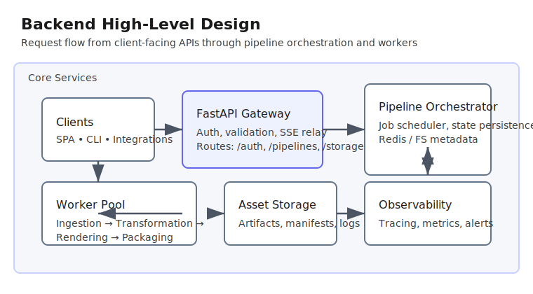
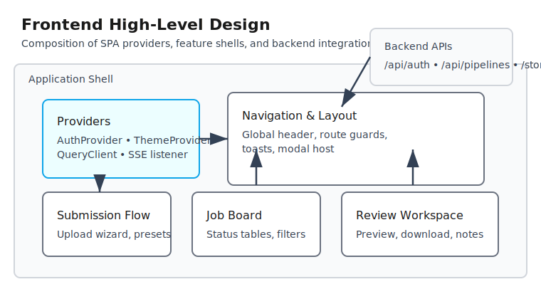
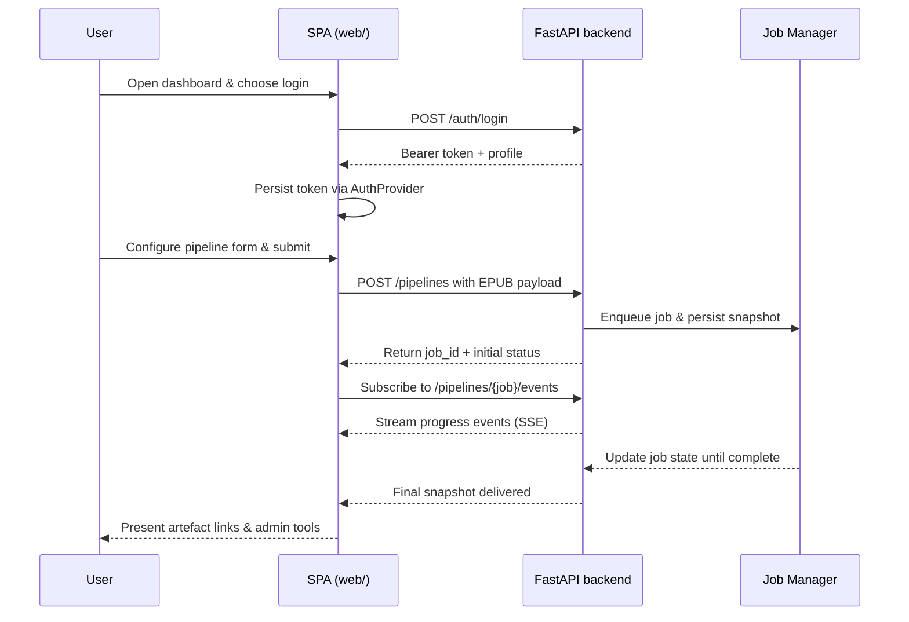

# ebook-tools

## Documentation

- [Architecture overview](docs/architecture.md)

### High-level diagrams

The main flows are summarised with the following HLD snapshots. Embed them in
design reviews or onboarding decks as needed to illustrate how the SPA, API, and
worker services collaborate.





## Backend setup

### Audio and video backend architecture

The synthesis stack is now modular. Text-to-speech is routed through the
`modules.audio.backends` registry, which ships with the Google Translate (gTTS)
and macOS `say` integrations but can be extended at runtime. Each backend
implements the `BaseTTSBackend` contract and is discovered via
`get_tts_backend()` using the values supplied in your configuration or
environment. Video rendering follows a similar pattern: a configurable backend
name is resolved and the concrete implementation (FFmpeg by default) can read
backend-specific knobs from `video_backend_settings`.【F:modules/audio/backends/__init__.py†L10-L95】【F:modules/video/backends/ffmpeg_renderer.py†L1-L185】

Key configuration switches now live alongside the rest of the pipeline
settings:

- `tts_backend` – Selects the TTS engine (`macos_say` or `gtts`). When omitted
  or set to `auto`, the resolver picks `macos_say` on Darwin hosts and `gtts`
  everywhere else.
- `tts_executable_path` – Optional override for the backend binary (e.g., point
  at a Homebrew installation of `say`).
- `macos_reading_speed` – Words per minute forwarded to the macOS backend.
- `video_backend` – Chooses the slide renderer (`ffmpeg` out of the box).
- `video_backend_settings` – Free-form dictionary keyed by backend name used to
  pass flags like `executable`, `loglevel`, or encoder presets to the selected
  renderer.

See `conf/config.json` for the canonical defaults and `modules/conf/config.local.json`
for a macOS-centric example config that pins the `say` binary and a Homebrew
FFmpeg install.【F:conf/config.json†L70-L111】【F:modules/conf/config.local.json†L1-L66】

#### Optional forced alignment

Word-level timelines benefit from light smoothing. Flip
`"forced_alignment_enabled": true` and calibrate
`"forced_alignment_smoothing"` (e.g. `0.35`) inside `config/config.local.json`
to let the decoder stretch sentence offsets before they are written to
`storage/<job_id>/metadata/`. The transcript/highlighting engine remains
functional without alignment, but enabling it significantly reduces jitter at
word boundaries.

### Install dependencies

1. Ensure Python 3.10 or newer is available on your system (the project is
   regularly verified against Python 3.11).
2. Create a virtual environment and install the package dependencies:

   ```bash
   python -m venv .venv
   source .venv/bin/activate  # Windows: .venv\\Scripts\\activate
   python -m pip install --upgrade pip
   pip install -e .
   ```

   The editable install wires up the `ebook-tools-api` console script and pulls in
   the FastAPI/uvicorn runtime declared in `pyproject.toml`. If you plan to run
   the test suite or lint checks, append `[dev]` to install the optional tooling
   bundle (`pip install -e .[dev]`).

### Launch the FastAPI server

With the virtual environment activated you can start the backend with any of the
following commands:

```bash
# Standard uvicorn invocation
uvicorn modules.webapi.application:create_app --factory --reload --host 0.0.0.0

# Python module entry point (resolves to the same uvicorn call)
python -m modules.webapi --reload --port 8000  # binds to 0.0.0.0 by default

# Installed console script shortcut
ebook-tools-api --reload --log-level debug  # binds to 0.0.0.0 by default

# Shell helper (wraps the module runner and adds a --port flag)
./scripts/run-webapi.sh --port 9000  # defaults to --host 0.0.0.0
```

Use `--reload` while iterating locally to enable hot-reloading. Once the server
starts, confirm it is reachable:

```bash
curl http://127.0.0.1:8000/
# {"status":"ok"}
```

If you prefer to verify via a browser, open <http://127.0.0.1:8000/>.

### Web API environment variables

Copy `.env.example` to `.env` at the project root and tweak the values before
starting uvicorn. The loader reads multiple files in order, so you can keep
shared defaults in `.env`, overrides in `.env.<name>` (by setting
`EBOOK_ENV=<name>`), and machine-specific tweaks in `.env.local`. Use
`EBOOK_ENV_FILE` to point at any additional file if you need to pull secrets
from a different location. All files are optional; values exported in the shell
still take precedence.

The FastAPI application inspects a few environment variables at startup to
control cross-origin requests and optional static hosting of the bundled
single-page application:

- **`EBOOK_API_CORS_ORIGINS`** – Comma or whitespace separated list of allowed
  origins for CORS. Defaults to the local API and Vite dev server URLs
  (`http://localhost`, `http://127.0.0.1`, `http://localhost:5173`,
  `http://127.0.0.1:5173`, plus the machine's LAN IP if available). Set to `*`
  to allow every origin or to an empty string to disable the middleware entirely.
- **`EBOOK_API_STATIC_ROOT`** – Filesystem path to the built web assets. When
  unset, the server looks for `web/dist/` relative to the repository root. Set
  this value to an empty string to run in API-only mode even if the directory
  exists.
- **`EBOOK_API_STATIC_INDEX`** – Filename served for client-side routes when
  static hosting is enabled (default: `index.html`).
- **`EBOOK_API_STATIC_MOUNT`** – URL prefix where the static files are exposed
  (default: `/`).
- **`JOB_STORE_URL`** – Redis (or compatible) URL used to persist job metadata.
  When unset the service falls back to filesystem persistence.
- **`EBOOK_STORAGE_BASE_URL`** – Public base URL for the storage routes exposed
  by the API. Downstream services and the SPA use this to resolve download
  links. Defaults to the API origin with `/storage` appended.
- **`JOB_STORAGE_DIR`** – Filesystem directory used by the fallback persistence
  layer. Defaults to `storage/jobs` relative to the working directory. The
  server creates the directory automatically when the first job is persisted.
- **`EBOOK_AUDIO_BACKEND`** – Override the text-to-speech backend used by the
  API (`macos_say` or `gtts`). When unset the resolver mirrors the configuration
  defaults and platform auto-detection.
- **`EBOOK_AUDIO_EXECUTABLE`** – Absolute path to the binary backing the active
  TTS backend (for example, a Homebrew-installed `say`). If omitted the
  configured path or bundled defaults are used.
- **`EBOOK_VIDEO_EXECUTABLE`** – Absolute path to the video rendering command
  (FFmpeg by default). Leaving this blank keeps the renderer pointed at the
  configured executable or system `ffmpeg`.

### Authenticate with the API

The dashboard and CLI now rely on the FastAPI session endpoints to issue and
refresh authentication tokens. Use the `/auth/login` route to obtain a bearer
token and attach it to subsequent requests via the `Authorization: Bearer`
header.

```bash
curl -X POST http://127.0.0.1:8000/auth/login \
  -H 'Content-Type: application/json' \
  -d '{"username":"admin","password":"secret"}'
# {"token":"<session>","user":{"username":"admin","role":"admin","last_login":"2024-05-01T12:34:56+00:00"}}

export EBOOKTOOLS_SESSION_TOKEN="<session>"
```

Keep the token in sync by calling `GET /auth/session` (used by the SPA to
restore persisted sessions), `POST /auth/logout`, and `POST /auth/password` when
rotating credentials. These handlers resolve to the functions defined in
`modules/webapi/auth_routes.py`, which in turn delegate to `AuthService` for
verification and metadata updates. Tokens can also be passed to SSE streams by
appending `?access_token=<token>` to the `/pipelines/{job_id}/events` URL so that
browser `EventSource` consumers remain authorised.【F:modules/webapi/auth_routes.py†L12-L139】【F:web/src/api/client.ts†L303-L317】

### Administrative API endpoints

Administrators can provision, suspend, or edit user accounts over HTTP through
`modules/webapi/admin_routes.py`. All routes require a valid bearer token that
belongs to a user with the `admin` role. Common flows include:

```bash
# List accounts and their roles/status metadata
curl -H "Authorization: Bearer $EBOOKTOOLS_SESSION_TOKEN" \
  http://127.0.0.1:8000/admin/users

# Create a new editor
curl -X POST http://127.0.0.1:8000/admin/users \
  -H "Authorization: Bearer $EBOOKTOOLS_SESSION_TOKEN" \
  -H 'Content-Type: application/json' \
  -d '{"username":"frank","password":"change-me","roles":["editor"],"email":"frank@example.com"}'

# Suspend an account or reset its password
curl -X POST -H "Authorization: Bearer $EBOOKTOOLS_SESSION_TOKEN" \
  http://127.0.0.1:8000/admin/users/frank/suspend
curl -X POST -H "Authorization: Bearer $EBOOKTOOLS_SESSION_TOKEN" \
  -H 'Content-Type: application/json' \
  -d '{"password":"new-secret"}' \
  http://127.0.0.1:8000/admin/users/frank/password
```

The responses surface normalised status flags (`status`, `is_active`,
`is_suspended`) and audit metadata (`created_at`, `updated_at`, `last_login`) for
use in the dashboard.【F:modules/webapi/admin_routes.py†L37-L288】

### Media generation API

Authenticated users with the `admin` or `media_producer` roles can request
on-demand media generation for existing pipeline jobs through the
`/api/media/generate` endpoint. The handler verifies the bearer token via the
standard auth middleware and rejects unauthorised (401) or insufficiently
privileged (403) callers with structured error payloads.

```bash
curl -X POST http://127.0.0.1:8000/api/media/generate \
  -H "Authorization: Bearer $EBOOKTOOLS_SESSION_TOKEN" \
  -H 'Content-Type: application/json' \
  -d '{
        "job_id": "job-123",
        "media_type": "audio",
        "parameters": {"voice": "demo"},
        "notes": "Regenerate narration with updated script"
      }'
# {"request_id":"…","status":"accepted","job_id":"job-123","media_type":"audio","requested_by":"admin"}
```

Responses follow the reusable `MediaGenerationResponse` and `MediaErrorResponse`
schemas defined in `modules/webapi/schemas/media.py`, making it easy for clients
to provide clear feedback to end users.【F:modules/webapi/media_routes.py†L1-L106】【F:modules/webapi/schemas/media.py†L1-L49】

### Pipeline job persistence cheatsheet

The API keeps a JSON snapshot of each job in `JOB_STORAGE_DIR` when Redis is
not configured. Every file is named `<job_id>.json`, making it easy to inspect
state or remove stale records manually:

```bash
ls storage/jobs
rm storage/jobs/<job_id>.json  # delete a single job
find storage/jobs -type f -name '*.json' -delete  # purge all persisted jobs
```

The REST API offers equivalent management operations if you prefer not to touch
the filesystem directly:

```bash
# List all persisted jobs ordered by creation time
curl -H "Authorization: Bearer $EBOOKTOOLS_SESSION_TOKEN" \
  http://127.0.0.1:8000/pipelines/jobs

# Pause, resume, cancel, or delete a specific job
curl -X POST -H "Authorization: Bearer $EBOOKTOOLS_SESSION_TOKEN" \
  http://127.0.0.1:8000/pipelines/jobs/<job_id>/pause
curl -X POST -H "Authorization: Bearer $EBOOKTOOLS_SESSION_TOKEN" \
  http://127.0.0.1:8000/pipelines/jobs/<job_id>/resume
curl -X POST -H "Authorization: Bearer $EBOOKTOOLS_SESSION_TOKEN" \
  http://127.0.0.1:8000/pipelines/jobs/<job_id>/cancel
curl -X POST -H "Authorization: Bearer $EBOOKTOOLS_SESSION_TOKEN" \
  http://127.0.0.1:8000/pipelines/jobs/<job_id>/delete
```

Restarting the application automatically reloads any JSON files from the
directory, pausing in-flight work and allowing it to be resumed, cancelled, or
cleaned up via the endpoints above.

When static hosting is disabled the JSON healthcheck remains available at `/`.
If the frontend bundle is served, the healthcheck can always be reached at
`/_health`.

### Usage examples

- **macOS narration with a specific voice** – Pin the platform backend and
  binary, and speed up narration:

  ```bash
  python main.py --tts-backend macos --selected-voice "Samantha" \
    --tts-executable /usr/bin/say --macos-reading-speed 180
  ```

- **Override the FFmpeg binary** – Point the renderer at a custom build via the
  config file or environment:

  ```json
  {
    "video_backend": "ffmpeg",
    "video_backend_settings": {
      "ffmpeg": {
        "executable": "/opt/homebrew/bin/ffmpeg",
        "loglevel": "info"
      }
    }
  }
  ```

  or set `EBOOK_VIDEO_BACKEND=ffmpeg` and `FFMPEG_PATH=/opt/homebrew/bin/ffmpeg`
  before launching the pipeline.【F:modules/config_manager/settings.py†L60-L110】

- **Plug a custom backend** – Register an implementation before invoking the
  pipeline. Any class inheriting `BaseTTSBackend` can be named and added to the
  registry:

  ```python
  from modules.audio.backends import BaseTTSBackend, register_backend


  class MyCloudBackend(BaseTTSBackend):
      name = "mycloud"

      def synthesize(self, *, text, voice, speed, lang_code, output_path=None):
          ...  # call your API and return an AudioSegment


  register_backend(MyCloudBackend.name, MyCloudBackend)
  ```

  Set `tts_backend` to `mycloud` and optionally expose custom keyword arguments
  via your own config loader if needed.【F:modules/audio/backends/__init__.py†L18-L43】【F:modules/audio/backends/base.py†L16-L44】

## Web UI workspace

The React/Vite client lives under `web/` and expects a Node 18+ toolchain.

### Install dependencies

```bash
cd web
npm install
```

### Run or build the client

- `npm run dev` starts the Vite development server on port 5173. Pass
  `-- --host 0.0.0.0` if you need to expose it to other devices on your network.
- `npm run build` produces a production bundle in `web/dist/`. Copy or point the
  backend's `EBOOK_API_STATIC_ROOT` at this directory to serve the build from
  FastAPI.
- `npm run preview` serves the production build for smoke testing.

### Configure the API base URL and storage endpoints

Duplicate `web/.env.example` to `web/.env` or `web/.env.local` and update the
values:

```bash
VITE_API_BASE_URL=http://127.0.0.1:8000
VITE_STORAGE_BASE_URL=http://127.0.0.1:8000/storage
```

`VITE_API_BASE_URL` controls where fetch requests are sent, while
`VITE_STORAGE_BASE_URL` is used for constructing download links to generated
artifacts. As with the backend, you can create environment-specific files such
as `web/.env.production` and pick them up by running Vite with the corresponding
mode (`npm run build -- --mode production`).

### Frontend capabilities

The SPA composes several providers to offer a multi-user dashboard:

- `AuthProvider` restores persisted sessions from `localStorage`, surfaces the
  current user/role, and injects bearer tokens into every request. It also
  exposes password rotation helpers that call `/auth/password`. Logout events
  automatically clear the cached token.【F:web/src/components/AuthProvider.tsx†L1-L122】
- `ThemeProvider` persists the preferred colour scheme (`light`, `dark`,
  `magenta`, or `system`) and sets the `<html data-theme>` attribute so that CSS
  variables adapt instantly. User preferences survive reloads via
  `localStorage`.【F:web/src/components/ThemeProvider.tsx†L1-L69】
- `PipelineSubmissionForm` is grouped into source, language, output,
  performance, and advanced sections. It draws defaults from
  `/pipelines/defaults`, lets users upload EPUBs, and validates overrides before
  calling `submitPipeline`.【F:web/src/App.tsx†L1-L89】
- `useWordHighlighting` together with the new transcript components
  (`TranscriptView`, `SegmentBlock`, and `Word`) consume the chunked timing
  manifests stored under `storage/<job_id>/metadata/` to render interleaved
  original/translation lanes. The hook enforces monotonic reveal fences while
  `TranscriptView` virtualises the DOM for large books; opt in by swapping the
  legacy word-sync container for `<TranscriptView />` (or guarding it behind a
  rollout flag). Flip `window.__HL_DEBUG__.enabled = true` during development to
  surface the large-seek and drift counters emitted by `AudioSyncController`.
- The job board renders active and historical jobs, keeps a registry of the
  latest SSE events per job, and exposes pause/resume/cancel/delete actions that
  map to `/pipelines/jobs/{job_id}/…` endpoints. Selecting a job opens
  `JobDetail`, which refreshes media metadata on demand.【F:web/src/App.tsx†L90-L215】
- Administrators gain access to the `UserManagementPanel`, a CRUD surface that
  lists accounts, normalises profile metadata, and issues suspend/activate or
  password-reset operations against the admin API.【F:web/src/components/admin/UserManagementPanel.tsx†L1-L154】

### Word-highlighting metadata flow

1. **Audio synthesis** → `modules/render/audio_pipeline.py` produces (and smooths) `word_tokens`.
2. **Timeline/exporters** → serialise `timingTracks.translation` into each chunk via `modules/core/rendering/exporters.py`.
3. **Persistence** → aggregated into `metadata/timing_index.json` by the job manager.
4. **Web API** → `/api/jobs/{job_id}/timing` returns the flattened per-word offsets.
5. **Frontend** → `InteractiveTextViewer` loads the track, feeds `timingStore`, and syncs highlights to `<audio>` playback.
6. **Validation** → `scripts/validate_word_timing.py` (plus CI) ensure drift stays below 50 ms with no overlaps.

For live QA you can enable a debug overlay in the browser console:

```js
window.__HL_DEBUG__ = { enabled: true }; // shows frame/index overlay
```

#### Audio generation + word highlighting

Audio narration is synthesised sentence-by-sentence inside
`modules/render/audio_pipeline.py`. Each worker sends the translated sentence,
target language, tempo, and voice selection to the configured TTS backend
(`macos_say` or `gtts` out of the box). The backend returns a
`pydub.AudioSegment`, which is bundled with the translation and queued for
persistence. If the backend embeds character timings (some engines expose
`char_timings` metadata), the rendering layer converts them into per-word events
and stores them in the chunk metadata (`metadata/chunk_*.json`). Otherwise the
renderer falls back to distributing word durations evenly across the sentence.

On the frontend the interactive reader pulls those chunk metadata files, builds
an in-memory index of tokens, and maps `<audio>` playback time to the nearest
token. The `timingStore` publishes the current token, the transcript components
subscribe to it, and `AudioSyncController` keeps the state in sync by querying
`HTMLAudioElement.currentTime` on each animation frame. No forced alignment is
required: the highlight engine is designed to work with sentence-level timing
when detailed per-word offsets are not available.

#### Frontend user journey



> **Tip:** The FastAPI loader merges `.env`, `.env.<env>`, and `.env.local` in
> that order. Vite follows a similar pattern based on the active mode, letting
> you keep per-environment tweaks checked in while secrets stay local.

## Run the stack end-to-end

1. **Start the backend.** Activate the Python virtual environment and launch
   uvicorn (`python -m modules.webapi --reload`). Ensure the healthcheck at
   <http://127.0.0.1:8000/> returns `{"status":"ok"}`.
2. **Start the frontend.** In a separate terminal run `npm run dev` from `web/`.
   The app becomes available at <http://127.0.0.1:5173/> and proxies API calls
   to the URL specified by `VITE_API_BASE_URL`.
3. **Sign in.** Use the login form in the dashboard or `POST /auth/login` from a
   terminal to obtain a session token. The SPA persists the token in
   `localStorage` and forwards it automatically with each request.
4. **Submit a pipeline job.** Trigger a run through the UI or by calling the API
    directly:

   ```bash
   curl -X POST http://127.0.0.1:8000/pipelines \
     -H 'Content-Type: application/json' \
     -d @payload.json
   ```

   The response contains a `job_id`.
5. **Watch progress via Server-Sent Events (SSE).** Stream updates with any SSE
   client. For example, `curl -N` keeps the connection open and prints each
   event:

   ```bash
   curl -N -H "Authorization: Bearer $EBOOKTOOLS_SESSION_TOKEN" \
     "http://127.0.0.1:8000/pipelines/<job_id>/events?access_token=$EBOOKTOOLS_SESSION_TOKEN"
   ```

   Each message contains a JSON `data:` payload shaped like
   `ProgressEventPayload` (see `modules/webapi/schemas.py`) with fields such as
   `event_type`, `timestamp`, `metadata`, and a `snapshot` describing counts and
   estimated time remaining. The stream automatically closes after a
   `complete` event or when the job tracker finishes emitting updates. In the
   browser, the UI listens to the same endpoint with the native `EventSource`
   API:

   ```ts
   const events = new EventSource(`${API_BASE_URL}/pipelines/${jobId}/events`);
   events.onmessage = (message) => {
   const payload = JSON.parse(message.data);
   console.log(payload.event_type, payload.snapshot);
 };
  ```

### CLI progress monitoring

When running the legacy CLI (`python main.py` or the `ebook-tools` console
script) the progress log now includes live system statistics sampled roughly
every ten seconds. Each progress update prints the current CPU utilisation,
resident memory usage (with percentage), and per-second read/write I/O rates of
the process. The metrics are collected with `psutil`, which is now part of the
core dependency set declared in `pyproject.toml`.

## Performance tuning and parallel rendering

Slide generation and translation can be CPU intensive. The project exposes a
few knobs through the interactive menu, CLI arguments, and configuration files
so you can tune throughput for your hardware.

### Interactive menu quick edits

When you launch the interactive configuration workflow (`python -m
modules.cli.main interactive`), option **12** controls the global worker thread
count used by the pipeline. Enter a value between 1 and 10 to balance overall
CPU usage against throughput.

### CLI flags

For non-interactive runs you can adjust the same settings with command line
options:

- `--thread-count` – overrides the number of worker threads used during
  ingestion and media generation.
- `--slide-parallelism {off,auto,thread,process}` – selects the backend used
  for per-frame slide rendering. Start with `auto` to let the renderer choose
  between thread and process pools based on the available worker count.
- `--slide-parallel-workers N` – caps the pool size used when slide
  parallelism is enabled. If omitted, the renderer falls back to the machine’s
  CPU count.
- `--prefer-pillow-simd` – hints that you have installed a SIMD-enabled Pillow
  build (e.g. Pillow-SIMD) and should use it for faster glyph rendering.
- `--benchmark-slide-rendering` – emits detailed timing metrics for slide
  generation when a parallel backend is not active.

Combine these flags with the `run` command:

```bash
python -m modules.cli.main run \
  --thread-count 8 \
  --slide-parallelism auto \
  --slide-parallel-workers 8 \
  --prefer-pillow-simd \
  path/to/book.epub
```

### Configuration files and environment overrides

All of the options above map to configuration keys if you prefer persistent
settings. Add them to `conf/config.local.json` (or another override file) and
the loader will pick them up on the next run.

```json
{
  "thread_count": 8,
  "slide_parallelism": "auto",
  "slide_parallel_workers": 8,
  "prefer_pillow_simd": true,
  "slide_render_benchmark": false
}
```

For machines with plenty of CPU cores and fast storage you can flip on every
performance-related toggle (including the aligner fallback) in your
`conf/config.local.json` with a block like the following:

```json
{
  "thread_count": 16,
  "queue_size": 64,
  "pipeline_mode": true,
  "slide_parallelism": "auto",
  "slide_parallel_workers": 16,
  "prefer_pillow_simd": true,
  "use_ramdisk": true,
  "forced_alignment_enabled": true,
  "forced_alignment_smoothing": "monotonic_cubic",
  "slide_render_benchmark": false
}
```

Feel free to raise the thread and worker counts if your host CPU and memory can
handle the additional concurrency; the queue size should scale with the number
of workers so translation and media rendering threads stay saturated.

Environment variables offer a lightweight override layer:

- `EBOOK_THREAD_COUNT` adjusts the global thread pool size.
- `EBOOK_PIPELINE_MODE`, `EBOOK_QUEUE_SIZE`, and related keys continue to work
  alongside the new slide-specific settings.

### Choosing a backend

Slide rendering falls back to sequential execution when only one frame needs to
be produced or when parallelism is set to `off`. In `auto` mode the renderer
promotes to the process pool if more than one worker is available, otherwise it
sticks with threads. You can force a specific strategy with `thread` or
`process` if you know the workload benefits from shared memory or completely
isolated workers.

Benchmarking data is only gathered when parallelism is disabled, so disable it
temporarily (`--slide-parallelism off --benchmark-slide-rendering`) to capture
detailed timing metrics before re-enabling your preferred backend.

## Configuration overview

`main.py` (and the backward-compatible `ebook-tools.py` wrapper) read their
baked-in defaults from `conf/config.json`. To keep
secrets and machine-specific tweaks out of version control, copy any fields you
want to change into `conf/config.local.json`; those overrides are merged on top
of the defaults at runtime. All relative paths are resolved from the repository
directory.

> **Tip:** `conf/config.local.json` is ignored by Git, so it's safe to add API
> keys, alternate model names, or other machine-specific values there.

### Directory settings
- **`ebooks_dir`**: Directory for source EPUB files and optional cover images.
  Defaults to `storage/ebooks/`, which lives next to `conf/`. The script resolves
  `input_file` and `book_cover_file` relative to this folder.
- **`working_dir`**: Root directory for generated artifacts such as stitched
  outputs. Cover images are mirrored under `storage/covers/` and each job keeps
  its metadata snapshot under `storage/<job_id>/metadata/`. Defaults to
  `output/`.
- **`output_dir`**: Location for generated HTML/PDF/EPUB/audio/video files.
  Defaults to `output/ebook/` inside the working directory.
- **`tmp_dir`**: Scratch space for intermediate assets such as slide images
  and concatenation lists. Defaults to `tmp/`.

You can override any of these via the matching CLI flags (`--ebooks-dir`,
`--working-dir`, `--output-dir`, `--tmp-dir`) or environment variables
(`EBOOKS_DIR`, `EBOOK_WORKING_DIR`, `EBOOK_OUTPUT_DIR`, `EBOOK_TMP_DIR`).

The default `storage/ebooks/` directory is ignored by Git so you can drop
`book.epub`, `book_cover.jpg`, and other local assets there without
accidentally committing them. Cover previews copied into `storage/covers/`
and job metadata stored under `storage/<job_id>/metadata/` follow the same
rule. Create the folders manually if they do not already exist.

### External tool settings
- **`ffmpeg_path`**: Path to the FFmpeg binary used by `pydub` and the video
  stitching helpers. Defaults to whatever `ffmpeg` is on your `PATH`.
- **`llm_source`**: Selects which Ollama adapter to use (`local` or `cloud`).
- **`ollama_url`**: Primary base URL for the active LLM source.
- **`ollama_local_url`**: Explicit URL for the local Ollama instance used when
  the source is `local` or as a fallback from cloud requests.
- **`ollama_cloud_url`**: Cloud endpoint leveraged when the source is `cloud`
  or when falling back from a failed local request.

These values accept overrides through CLI flags (`--ffmpeg-path`,
`--ollama-url`, `--llm-source`) or the environment variables `FFMPEG_PATH`,
`OLLAMA_URL`, and `LLM_SOURCE`. You can also provide `OLLAMA_LOCAL_URL` and
`OLLAMA_CLOUD_URL` to override the per-source endpoints. When both sources are
configured, the runtime automatically retries the alternate adapter if the
preferred endpoint is unavailable or rate limited.

### Using the settings
- Interactive mode (`ebook-tools interactive` or `python main.py -i`) exposes each knob in the
  menu, so you can persist new defaults back into `conf/config.local.json`.
- In non-interactive mode, CLI flags or environment variables take precedence
  over the JSON values. The script resolves relative paths against the working
  copy and creates directories as needed.

### CLI entry point

The refactored CLI lives under the `ebook-tools` console script. The command
supports explicit sub-commands while remaining compatible with the historical
positional arguments:

```bash
# Run the pipeline non-interactively using arguments or config.local.json
ebook-tools run --config conf/config.local.json

# Launch the interactive configuration menu with optional overrides
ebook-tools interactive --config conf/config.local.json --ebooks-dir ~/Books --llm-source cloud

# Legacy style invocation is still supported for scripts and automation
python modules/ebook_tools.py <input.epub> "English" "Arabic" 10
```

Both sub-commands honour the same overrides as before (`--ebooks-dir`,
`--output-dir`, etc.) and interactive updates continue to save back into the
`conf/config.local.json` file when possible.

## User accounts, roles, and sessions

The CLI bundles a lightweight authentication layer so that shared machines can
require logins before the pipeline runs. Credentials are managed via
`ebook-tools user` sub-commands and can be backed by different persistence
strategies. By default the bundled [`LocalUserStore`](modules/user_management/local_user_store.py)
keeps credentials in `config/users/users.json` and stores active sessions next
to the current user's home directory.

- Bootstrap new environments by copying `config/users/users.sample.json` to
  `config/users/users.json`. The sample includes hashed placeholders for an
  administrator and a standard operator so the application can start, but you
  **must** immediately rotate them with `ebook-tools user password <username>`.
  The CLI updates the bcrypt-compatible hash in place and supports interactive
  prompts when the `--password` flag is omitted.
- Use `ebook-tools user add <username>` to create the first administrator. Pass
  `--role admin --role editor` (or any other role labels your workflow
  requires) to seed role-based permissions.
- `ebook-tools user login <username>` prompts for a password, creates a session
  token, and writes it to `~/.ebooktools_active_session`. Subsequent CLI
  commands pick the token up automatically. Export `EBOOKTOOLS_SESSION_TOKEN`
  to override the automatic discovery when scripting.
- Run `ebook-tools user list` to inspect registered accounts and their role
  assignments. `ebook-tools user logout` revokes a token and clears the active
  session file.

You can pin the storage locations or replace the backend entirely by editing
`config/config.local.json`:

```json
{
  "authentication": {
    "user_store": {
      "backend": "local",
      "storage_path": "config/users/users.json"
    },
    "sessions": {
      "session_file": "~/.ebooktools_session.json",
      "active_session_file": "~/.ebooktools_active_session"
    }
  }
}
```

Set the matching environment variables (`EBOOKTOOLS_USER_STORE`,
`EBOOKTOOLS_SESSION_FILE`, and `EBOOKTOOLS_ACTIVE_SESSION_FILE`) to override the
paths at runtime. See [docs/user-management.md](docs/user-management.md) for a
deeper walkthrough of the workflow, the role semantics, and guidance on adding
new backends.
