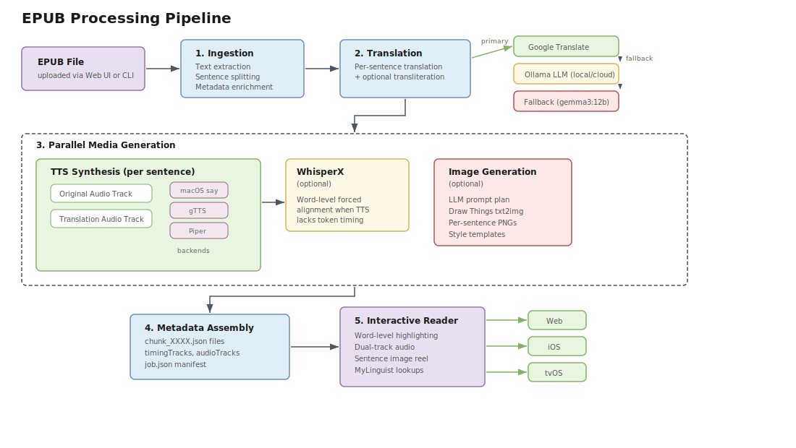
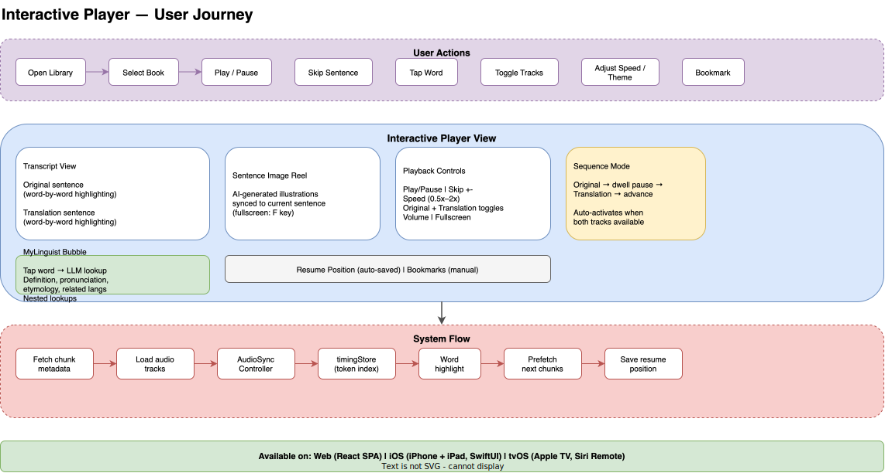

# ebook-tools

A toolkit that transforms EPUB books into multi-language narrated experiences
with word-level audio highlighting, AI-generated sentence illustrations, and
interactive playback across Web, iOS, and Apple TV.

## Features

- **Multi-language translation** — Google Translate with LLM fallback (Ollama local/cloud), batch processing, transliteration support
- **Text-to-speech narration** — macOS `say`, Google TTS, Piper (offline neural) with automatic backend selection
- **Word-level audio sync** — Real-time word-by-word highlighting driven by backend tokens, WhisperX forced alignment, or character-weighted inference
- **Dual-track playback** — Original and translation audio with sequence mode (alternates per sentence with dwell pauses)
- **AI sentence illustrations** — Draw Things / Stable Diffusion image generation with LLM-powered prompt plans and style templates
- **MyLinguist dictionary** — Tap any word for LLM-powered lookups with definitions, etymology, pronunciation, and related languages
- **Interactive reader** — Chunk-based navigation, bookmarks, resume position, keyboard shortcuts, theme customisation
- **YouTube dubbing** — Subtitle extraction, translation, and dubbed audio rendering for video files
- **Multi-platform** — Web (React SPA), iOS (iPhone/iPad), tvOS (Apple TV)
- **Role-based access** — JWT authentication with admin, editor, and media_producer roles

## Architecture at a Glance


The system is composed of a **Python backend** (FastAPI) that orchestrates
translation, audio synthesis, and image generation through a parallel worker
pipeline; a **React SPA** (Vite + Zustand) served by Nginx; and native
**iOS/tvOS apps** (SwiftUI). All clients communicate through a REST API with
SSE progress streaming.

See [docs/architecture.md](docs/architecture.md) for the full architecture
deep-dive and module map.

## Quick Start

### Docker (Recommended)

```bash
docker compose up -d          # start backend + frontend
docker compose logs -f        # follow logs
curl http://localhost:8000/_health  # verify backend
```

See [docs/deployment.md](docs/deployment.md) for volume mounts, environment
variables, TLS setup, and troubleshooting.

### Local Development

```bash
# Backend
python -m venv .venv && source .venv/bin/activate
pip install -e .[dev]
uvicorn modules.webapi.application:create_app --factory --reload --host 0.0.0.0

# Frontend
cd web && npm install && npm run dev
```

See [docs/developer-guide.md](docs/developer-guide.md) for full setup, API
reference, CLI usage, and configuration.

## Processing Pipeline



An EPUB goes through ingestion, translation, parallel TTS synthesis (with
optional WhisperX alignment and image generation), metadata assembly, and
becomes available in the Interactive Reader — all monitored in real-time via
SSE.

## Interactive Player



The Interactive Player is the core experience: word-level highlighting synced
to dual-track audio, a sentence image reel, and the MyLinguist dictionary
bubble — available on Web, iOS, and tvOS.

See [docs/user-guide.md](docs/user-guide.md) for the full walkthrough.

## Platforms

| Platform | Technology | Key Features |
|---|---|---|
| **Web** | React, TypeScript, Vite, Zustand | Full pipeline wizard, job board, admin panel, keyboard shortcuts |
| **iOS** | SwiftUI, AVFoundation | Apple Music integration, offline playback, split view (iPad) |
| **tvOS** | SwiftUI, Siri Remote | Living-room playback experience |

## Documentation

| Document | Description |
|---|---|
| [User Guide](docs/user-guide.md) | How to use the app (processing books, interactive player, library) |
| [Architecture](docs/architecture.md) | System design, module map, metadata flow, MyLinguist |
| [Developer Guide](docs/developer-guide.md) | Backend/frontend/iOS setup, API reference, CLI, configuration |
| [Deployment](docs/deployment.md) | Docker Compose, volume mounts, TLS, production access |
| [Testing](docs/testing.md) | Test suite, markers, E2E across 4 platforms |
| [Sentence Images](docs/sentence_images.md) | Draw Things integration, prompt generation, image pipeline |
| [User Management](docs/user-management.md) | Authentication, roles, sessions, CLI commands |
| [Word Highlighting](docs/interactive_reader_metadata.md) | Timing tracks, highlighting policies, chunk metadata format |
| [Sentence Highlighting](docs/sentence_highlighting.md) | Character-weighted inference, validation |
| [Frontend Sync](docs/frontend-sync.md) | Multi-device environment synchronisation checklist |

## Diagrams

All diagrams are maintained as [draw.io](https://www.diagrams.net/) source
files in [`docs/diagrams/`](docs/diagrams/). Exported SVGs live in
[`docs/images/`](docs/images/).

| Diagram | Description |
|---|---|
| [System Overview](docs/images/system-overview.svg) | Full-stack architecture |
| [Pipeline Flow](docs/images/pipeline-flow.svg) | EPUB processing data flow |
| [Player Journey](docs/images/player-journey.svg) | Interactive reader user journey |
| [Frontend Architecture](docs/images/frontend-arch.svg) | React component and view map |
| [Backend Modules](docs/images/backend-modules.svg) | Python package dependency map |
| [Test Architecture](docs/images/test-architecture.svg) | Test suite structure |

## Testing

The project has **800+ tests** across 16 pytest markers with E2E coverage on
4 platforms (Web, iPhone, iPad, tvOS).

```bash
pytest -m webapi          # targeted: FastAPI routes
pytest -m audio           # targeted: TTS backends
make test-fast            # quick feedback (not slow, not integration)
make test-e2e-all         # E2E: all 4 platforms
```

See [docs/testing.md](docs/testing.md) for the complete testing guide.

## Contributing

1. Read the [Developer Guide](docs/developer-guide.md) for setup
2. Run targeted tests for the domain you changed (`pytest -m <marker>`)
3. Only run the full suite for wide-ranging changes
