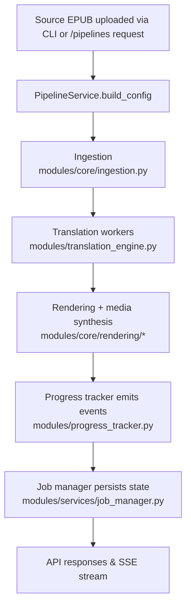

# ebook-tools Architecture

## Project Layout
- `main.py` – CLI launcher that wires configuration, logging, and live progress display for the pipeline.
- `modules/` – Python package containing configuration helpers, pipeline core logic, media synthesis, observability, and web API.
- `web/` – React/Vite single-page application that talks to the FastAPI backend.
- `scripts/` – Shell helpers (`run-webapi.sh`, `run-webui.sh`) that wrap common dev workflows.
- `books/`, `output/`, `tmp/`, `log/` – Default working directories used by the runtime context for source EPUBs, generated artifacts, temp data, and logs.

## Pipeline Flow
1. **Entry point** – `modules/ebook_tools.py` parses CLI or interactive input and builds a `PipelineRequest`.
2. **Pipeline execution** – `modules/services/pipeline_service.py` assembles a `PipelineConfig`, coordinates ingestion, translation, rendering, and media generation, and returns a `PipelineResponse`.
3. **Ingestion** – `modules/core/ingestion.py` extracts EPUB text, splits it into sentences, and caches refined lists.
4. **Translation** – `modules/translation_engine.py` runs sentence translations through worker pools backed by the configured LLM client.
5. **Rendering & media** – `modules/core/rendering/`, `modules/output_formatter.py`, and `modules/audio_video_generator.py` create HTML/PDF documents, audio narration, and optional video batches.
6. **Observability** – `modules/progress_tracker.py` emits structured events that feed CLI logs and the API SSE stream; `modules/observability.py` wraps stages with structured logging/telemetry.

### Audio/video backend architecture

Audio synthesis is handled by a lightweight registry that maps logical backend
names to `BaseTTSBackend` implementations. The default registry contains the
Google Translate (gTTS) HTTP client and a macOS bridge that shells out to the
`say` binary. `get_tts_backend()` inspects the pipeline config, CLI arguments,
and environment-backed defaults (via `config_manager`) to decide which backend
to instantiate and forwards any configured executable override. Custom backends
can be registered at import time using `register_backend()` before the pipeline
spins up workers.【F:modules/audio/backends/__init__.py†L10-L95】

Video slide rendering uses a comparable pattern. `modules/config/loader.py`
resolves the selected `video_backend` and optional `video_backend_settings`
mapping, then the rendering layer instantiates the appropriate renderer through
`modules/render/backends/__init__.py`. The built-in FFmpeg renderer honours
settings such as `executable`, `loglevel`, and preset overrides, allowing the
pipeline to run against system installations or portable builds without code
changes.【F:modules/config/loader.py†L20-L135】【F:modules/video/backends/ffmpeg.py†L32-L117】

### Backend input processing diagram

## Runtime Services
- `modules/services/job_manager.py` tracks job metadata, persists state (memory or Redis), and exposes lifecycle operations.
- `modules/config_manager.py` resolves configuration files, environment overrides, and runtime directories. `modules/environment.py` layers `.env` files on import.
- `modules/logging_manager.py` centralises structured logging primitives and console helpers.
- `modules/metadata_manager.py` infers book metadata that can be refreshed mid-run.

## API Surface
- `modules/webapi/application.py` creates the FastAPI app, configures CORS, serves SPA assets, and exposes health checks.
- `modules/webapi/routes.py` offers endpoints to browse files, submit pipeline jobs, refresh metadata, poll status, and stream progress via Server-Sent Events.
- `modules/webapi/dependencies.py` wires dependency injection for the pipeline service, runtime context, and job store selection.
- `modules/webapi/auth_routes.py` issues bearer tokens, reports active session metadata, rotates passwords, and revokes sessions via `AuthService`.
- `modules/webapi/admin_routes.py` provides CRUD operations for user accounts, normalises profile metadata, and enforces the `admin` role on every request.

## Frontend
- The Vite client in `web/` consumes `VITE_API_BASE_URL`/`VITE_STORAGE_BASE_URL` to call the backend and display pipeline progress.
- `AuthProvider` wraps the app to restore sessions from `localStorage`, attach bearer tokens to every fetch, and expose login/logout/password helpers to the UI shell.【F:web/src/components/AuthProvider.tsx†L1-L122】
- `ThemeProvider` stores the preferred appearance (light, dark, magenta, or system) and updates the `data-theme` attribute so CSS variables react to the selected palette.【F:web/src/components/ThemeProvider.tsx†L1-L69】
- `App.tsx` orchestrates the pipeline form sections, job registry, SSE subscriptions, and admin panel toggle based on the authenticated user's role.【F:web/src/App.tsx†L1-L215】
- Build artifacts (`web/dist/`) can be served by the API when `EBOOK_API_STATIC_ROOT` points to the directory.
