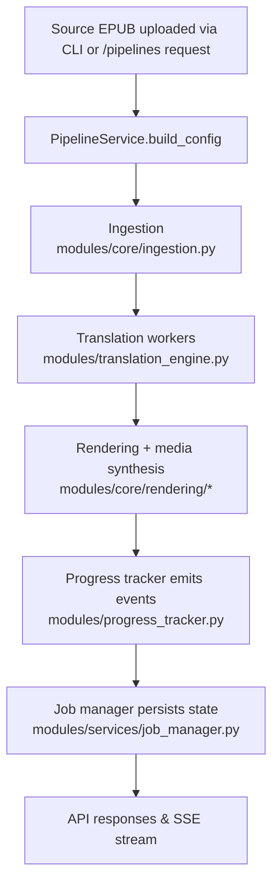

# ebook-tools Architecture

## Project Layout
- `main.py` – CLI launcher that wires configuration, logging, and live progress display for the pipeline.
- `modules/` – Python package containing configuration helpers, pipeline core logic, media synthesis, observability, and web API. The library subsystem now splits responsibilities across `modules/library/library_models.py`, `library_repository.py`, `library_metadata.py`, `library_sync.py`, and the orchestration facade in `library_service.py`.
- `modules/images/` – Draw Things / Stable Diffusion client + prompt helpers for sentence/batch image generation.
- `modules/subtitles/` – Subtitle parsing and translation utilities used by `SubtitleService` and the subtitle job API.
- `web/` – React/Vite single-page application that talks to the FastAPI backend.
- `scripts/` – Shell helpers (`run-webapi.sh`, `run-webui.sh`) that wrap common dev workflows.
- `storage/ebooks/`, `storage/covers/`, `storage/<job_id>/metadata/`, `storage/<job_id>/media/`, `output/`, `tmp/`, `log/` – Default working directories used by the runtime context for source EPUBs, consolidated cover images, per-job metadata snapshots, generated artifacts, temp data, and logs. Highlight metadata now lives in chunked JSON files (`metadata/chunk_0000.json`, etc.) referenced by a compact `metadata/job.json` manifest; `MetadataLoader` in `modules/metadata_manager.py` abstracts loading chunk summaries and legacy single-file payloads.

## Pipeline Flow
1. **Entry point** – `modules/ebook_tools.py` parses CLI or interactive input and builds a `PipelineRequest`.
2. **Pipeline execution** – `modules/services/pipeline_service.py` assembles a `PipelineConfig`, coordinates ingestion, translation, rendering, and media generation, and returns a `PipelineResponse`.
3. **Ingestion** – `modules/core/ingestion.py` extracts EPUB text, splits it into sentences, and caches refined lists.
4. **Translation** – `modules/translation_engine.py` runs sentence translations through worker pools backed by the configured LLM client.
5. **Rendering & media** – `modules/core/rendering/`, `modules/output_formatter.py`, and `modules/audio_video_generator.py` create HTML/PDF documents, audio narration, optional sentence/batch images, and optional video batches.
6. **Observability** – `modules/progress_tracker.py` emits structured events that feed CLI logs and the API SSE stream; `modules/observability.py` wraps stages with structured logging/telemetry.

### Audio/video backend architecture

Audio synthesis is handled by a lightweight registry that maps logical backend
names to `BaseTTSBackend` implementations. The default registry contains the
Google Translate (gTTS) HTTP client and a macOS bridge that shells out to the
`say` binary. `get_tts_backend()` inspects the pipeline config, CLI arguments,
and environment-backed defaults (via `config_manager`) to decide which backend
to instantiate and forwards any configured executable override. When callers do
not specify a backend, the resolver chooses `macos_say` on Darwin systems and
`gtts` elsewhere before instantiating the engine. Custom backends
can be registered at import time using `register_backend()` before the pipeline
spins up workers (`modules/audio/backends/`).

#### Audio worker lifecycle

Audio rendering happens inside `modules/render/audio_pipeline.py`. Translation
tasks are queued per sentence; dedicated `AudioWorker` instances consume them
and call the selected backend via the shared `AudioGenerator` protocol. Each
worker receives the sentence, translation, language metadata, tempo, and voice
selection. The synthesizer returns a `pydub.AudioSegment` (or the richer
`SynthesisResult` wrapper when voice metadata is available). The worker hands
the resulting `AudioSegment` to `MediaPipelineResult`, which is later persisted
through the job manager. No word-level tokens are emitted at this stage—timing
information is inferred later from the rendered audio if a backend embeds
character timings, otherwise sentence-level durations are used (`modules/render/audio_pipeline.py`).

Timing metadata for highlights therefore originates from the rendering layer,
not from forced alignment. `modules/core/rendering/timeline.py` collapses any
embedded character timings into word-level tokens and falls back to evenly
distributing tokens when necessary. Those per-word offsets are persisted as
chunk-level `timingTracks`; per-sentence timeline events are no longer stored
inside `metadata/chunk_*.json` (`modules/core/rendering/exporters.py`).

Video slide rendering uses a comparable pattern. `modules/config/loader.py`
resolves the selected `video_backend` and optional `video_backend_settings`
mapping, then the rendering layer instantiates the appropriate renderer through
`modules/render/backends/__init__.py`. The built-in FFmpeg renderer honours
settings such as `executable`, `loglevel`, and preset overrides, allowing the
pipeline to run against system installations or portable builds without code
changes (`modules/config/loader.py`, `modules/video/backends/ffmpeg_renderer.py`).

### Sentence image generation

When `add_images` is enabled, `RenderPipeline` (`modules/core/rendering/pipeline.py`) generates PNGs in parallel with translation. By default it batches sentences (`image_prompt_batching_enabled=true`, `image_prompt_batch_size=10`) so one image persists for an entire sentence batch in the player. The pipeline:

1. Precomputes a consistent prompt plan for the selected sentence window (`modules/images/prompting.py:sentences_to_diffusion_prompt_plan`). When batching is enabled, the renderer groups sentences into batches and asks for one prompt per batch. Prompt-plan requests are chunked by `image_prompt_plan_batch_size` (capped at 50) and images begin rendering as each chunk completes.
   - Persists the prompt plan to `metadata/image_prompt_plan.json` for debugging/QA.
2. Appends the selected style template base + negative prompts (`image_style_template`, `build_sentence_image_prompt`, `build_sentence_image_negative_prompt`) to keep the reel visual style consistent.
3. Calls a Draw Things / AUTOMATIC1111-compatible `txt2img` endpoint via `DrawThingsClient` (`modules/images/drawthings.py`) using the configured diffusion parameters.
4. Writes images under `media/images/batches/batch_XXXXX.png` when batching is enabled (or `media/images/<range_fragment>/sentence_XXXXX.png` when disabled) and merges the image metadata back into each chunk’s `sentences[]` entries (`image`, `image_path`/`imagePath`) so `/api/pipelines/jobs/{job_id}/media/live` can surface them during running jobs.

### Metadata creation & highlighting controls

`modules/services/job_manager/persistence.py` emits every metadata artefact a
job needs: `metadata/job.json` (global metadata + `chunk_manifest`),
`metadata/chunk_manifest.json`, and per-chunk files (`metadata/chunk_XXXX.json`)
that retain their own `timingTracks`. Legacy installs may still have an
aggregated `metadata/timing_index.json`, but new jobs no longer generate it.
`MetadataLoader` in `modules/metadata_manager.py` is the canonical read path so
CLI helpers, the FastAPI routers, and tests can treat the legacy single-file
payload and the new chunked layout interchangeably. Highlight provenance originates inside
`modules/render/audio_pipeline.py`, which records whether a sentence used
backend tokens, WhisperX (`modules/align/backends/whisperx_adapter.py`),
char-weighted, or uniform inference. `EBOOK_HIGHLIGHT_POLICY`,
`char_weighted_highlighting_default`, `char_weighted_punctuation_boost`, and the
forced-alignment settings determine which strategy is permitted; the resulting
`highlighting_policy` summary is stored at the chunk level alongside
`timingTracks` (and `/api/jobs/{job_id}/timing` when present) for the frontend
and QA tooling.

### Backend input processing diagram

## Runtime Services
- `modules/services/job_manager.py` tracks job metadata, persists state (memory or Redis), and exposes lifecycle operations.
- `modules/services/subtitle_service.py` schedules subtitle translation jobs and stages generated subtitle files under each job's `subtitles/` directory.
- `modules/config_manager.py` resolves configuration files, environment overrides, and runtime directories. `modules/environment.py` layers `.env` files on import.
- `modules/logging_manager.py` centralises structured logging primitives and console helpers.
- `modules/metadata_manager.py` infers book metadata that can be refreshed mid-run.

### Subtitle processing notes
- YouTube-style cues are merged into ~5s windows during parsing, not by mutating the source file. `process_subtitle_file` calls `merge_youtube_subtitle_cues` when `_should_merge_youtube_cues` tags the input (explicit `source_is_youtube` flag from the router or heuristics: filename hints plus dense short overlaps), otherwise it only collapses redundant text windows (`modules/subtitles/processing.py`).
- Dubbing uses the same merged windows for every video source. `_parse_dialogues` feeds SRT/VTT/SUB subtitles through `merge_youtube_subtitle_cues` before building dialogue windows, and `_normalize_dialogue_windows` enforces gaps/min durations (`modules/services/youtube_dubbing/dialogues.py`). The downstream audio renderer and ASS exports therefore share the merged timeline for YouTube downloads and generic NAS videos alike.
- WebVTT companions mirror the merged view: both `_ensure_webvtt_variant` (subtitle copies) and `_ensure_webvtt_for_video` (batch-aligned VTTs) parse with `_parse_dialogues`, so NAS and YouTube artifacts stay consistent (`modules/services/youtube_dubbing/webvtt.py`).
- Because merging happens on read, the stored SRT/ASS next to a video remains untouched; the rendered ASS/SRT/VTT outputs and dubbing schedules are derived from the merged cue set.

## API Surface
- `modules/webapi/application.py` creates the FastAPI app, configures CORS, serves SPA assets, and exposes health checks.
- `modules/webapi/routes.py` offers endpoints to browse files, submit pipeline jobs, refresh metadata, poll status, and stream progress via Server-Sent Events.
- `modules/webapi/dependencies.py` wires dependency injection for the pipeline service, runtime context, and job store selection.
- `modules/webapi/auth_routes.py` issues bearer tokens, reports active session metadata, rotates passwords, and revokes sessions via `AuthService`.
- `modules/webapi/admin_routes.py` provides CRUD operations for user accounts, normalises profile metadata, and enforces the `admin` role on every request.
- `modules/webapi/routes/media_routes.py` exposes job media snapshots (`/api/pipelines/jobs/{job_id}/media`) plus sentence-image inspection/regeneration endpoints (`/api/pipelines/jobs/{job_id}/media/images/sentences/{sentence_number}`).
- `modules/webapi/routers/subtitles.py` exposes endpoints to submit subtitle jobs, browse available source files, stream progress, and retrieve processed DRT subtitles.

## Frontend
- The Vite client in `web/` consumes `VITE_API_BASE_URL`/`VITE_STORAGE_BASE_URL` to call the backend and display pipeline progress.
- `AuthProvider` wraps the app to restore sessions from `localStorage`, attach bearer tokens to every fetch, and expose login/logout/password helpers to the UI shell (`web/src/components/AuthProvider.tsx`).
- `ThemeProvider` stores the preferred appearance (light, dark, magenta, or system) and updates the `data-theme` attribute so CSS variables react to the selected palette (`web/src/components/ThemeProvider.tsx`).
- `App.tsx` orchestrates the pipeline form sections, job registry, SSE subscriptions, and admin panel toggle based on the authenticated user's role (`web/src/App.tsx`).
- `SubtitleToolPage.tsx` provides the subtitle workflow UI, including source selection, language configuration, and live status tracking for subtitle jobs (`web/src/pages/SubtitleToolPage.tsx`).
- Build artifacts (`web/dist/`) can be served by the API when `EBOOK_API_STATIC_ROOT` points to the directory.

### Word highlighting on the web client

Interactive playback lives under `web/src/components/InteractiveTextViewer.tsx`.
Chunks supplied by the API ship with timing tracks (`timingTracks`) and chunked
sentence metadata. The viewer resolves the preferred track (translated audio or
original/translated mix), builds a word index, and uses it to drive the
highlighting experience. The current implementation supports two rendering
modes:

1. **Legacy word-sync DOM** — mirrors the older experience where spans receive
   `is-active`/`is-visited` classes driven by a `WordSyncController`.
2. **Transcript view** — the new default, backed by `TranscriptView` and
   `timingStore`, renders interleaved original/translation lanes with virtual
   scrolling support. Playback progress is sampled from the `<audio>` element,
   mapped to the nearest token via utilities in `web/src/utils/timingSearch.ts`,
   and stored in `timingStore`. Components subscribe to the store to react to
   highlight changes.

Because the backend no longer emits per-sentence timeline events, the frontend
derives coarse sentence timelines from token counts plus phase/duration metadata
when word sync is unavailable. If a backend provides detailed word timings they
are preserved; otherwise tokens are distributed uniformly across each sentence
duration while maintaining monotonic progression.

### Word-highlighting metadata flow

1. `modules/render/audio_pipeline.py` emits and smooths `word_tokens` for each sentence.
2. `modules/core/rendering/exporters.py` serialises `timingTracks.translation` into `chunk_*.json`.
3. `modules/services/job_manager/persistence.py` persists those tracks alongside the per-chunk metadata (no new global aggregate).
4. `modules/webapi/routes/media_routes.py` still exposes `/api/jobs/{job_id}/timing` when historical aggregates exist; otherwise the frontend leans entirely on chunk metadata.
5. `web/src/components/InteractiveTextViewer.tsx` hydrates chunk metadata lazily, updates `timingStore` when a timing payload is available, and keeps highlights in sync with audio playback.
6. `scripts/validate_word_timing.py` (referenced by CI) now only applies to legacy aggregates; new QA tooling should read per-chunk payloads directly.
