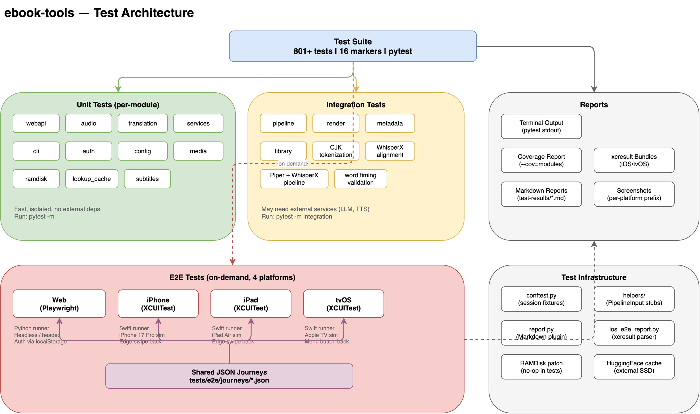

# Testing Guide

## Overview

The ebook-tools project has a comprehensive test suite with **801+ tests** that
are fully green (10 skipped). Tests are organized by domain using pytest markers,
enabling fast targeted runs during development. End-to-end tests run on-demand
across **4 platforms**: Web (Playwright), iPhone, iPad, and tvOS (XCUITest).



**Key characteristics:**

- **pytest-based** with 16 custom markers for domain isolation
- **E2E tests excluded by default** (`addopts = "-rs -m 'not e2e'"`)
- **Session-scoped fixtures** prevent real RAMDisk mounts during tests
- **Shared JSON journey architecture** for cross-platform E2E consistency
- **Markdown reports with screenshots** for E2E results

## Running Tests

### Quick Start

```bash
# Install dev dependencies
pip install -e .[dev]

# Run the full suite (801+ tests)
pytest

# Run a specific domain
pytest -m webapi

# Fast feedback loop (skip slow and integration tests)
make test-fast
```

### Targeted Testing (Preferred)

Targeted test runs are the recommended workflow. They complete in seconds rather
than minutes, keep feedback tight, and let you focus on the domain you are
changing. Only run the full suite for wide-ranging changes like core refactors,
dependency upgrades, or configuration changes that touch many modules.

#### Marker Reference

All markers are defined in `pyproject.toml` under `[tool.pytest.ini_options]`.

| Marker | Domain | Description |
|--------|--------|-------------|
| `webapi` | Web API | FastAPI routes, middleware, CORS, auth endpoints |
| `services` | Services | Job manager, pipeline service, file locator, assistant |
| `pipeline` | Pipeline | Core rendering pipeline, multi-sentence chunks, timeline |
| `audio` | Audio | TTS backends, voice selection, audio highlighting |
| `translation` | Translation | Translation engine, batch processing, CJK tokenization |
| `metadata` | Metadata | Metadata enrichment, structured conversion, library metadata |
| `cli` | CLI | Command-line interface, args parsing, user commands |
| `auth` | Auth | User management, session management, auth service |
| `library` | Library | Library sync, indexer, repository |
| `render` | Render | Output writer, text pipeline, parallel dispatch |
| `media` | Media | Command runner, media backends |
| `config` | Config | Config manager, storage settings, runtime context |
| `ramdisk` | RAMDisk | RAMDisk lifecycle, guard, mount/unmount |
| `observability` | Observability | Prometheus metrics, dashboard PromQL coverage, JSON validation |
| `slow` | Slow | Tests that take >2s (WhisperX, Piper, pipelines) |
| `integration` | Integration | End-to-end workflows requiring external services |
| `e2e` | E2E | Browser/device tests via Playwright (requires running app) |

#### Examples

```bash
# Run a single domain
pytest -m webapi
pytest -m audio
pytest -m translation

# Combine markers
pytest -m "services or pipeline"
pytest -m "not slow and not integration"

# Run a specific test file
pytest tests/modules/webapi/test_job_media_routes.py -v

# Run a specific test by name
pytest -k "test_dashboard_loads" -v
```

### Makefile Shortcuts

The Makefile provides convenient targets for every domain.

| Target | Command | Description |
|--------|---------|-------------|
| `make test` | `pytest` | Full suite (801+ tests) |
| `make test-fast` | `pytest -m "not slow and not integration"` | Skip slow and integration tests |
| `make test-audio` | `pytest -m audio` | TTS backends and audio tests |
| `make test-translation` | `pytest -m translation` | Translation engine tests |
| `make test-webapi` | `pytest -m webapi` | FastAPI route tests |
| `make test-services` | `pytest -m services` | Job manager and service tests |
| `make test-pipeline` | `pytest -m pipeline` | Core pipeline tests |
| `make test-cli` | `pytest -m cli` | CLI argument and command tests |
| `make test-auth` | `pytest -m auth` | Authentication and session tests |
| `make test-library` | `pytest -m library` | Library sync and indexer tests |
| `make test-render` | `pytest -m render` | Output writer and text pipeline tests |
| `make test-media` | `pytest -m media` | Media command runner tests |
| `make test-config` | `pytest -m config` | Config manager tests |
| `make test-metadata` | `pytest -m metadata` | Metadata enrichment tests |

### Full Suite

Run the full suite when your changes are wide-ranging:

- Core refactors that touch shared utilities
- Dependency upgrades (`pip install --upgrade`)
- Configuration schema changes
- Fixture or conftest modifications

```bash
# Full suite
pytest

# With coverage report
pytest --cov=modules

# Verbose output
pytest -v
```

## Test Architecture

### Directory Structure

```
tests/
├── conftest.py                          # Session fixtures, ramdisk patches, CLI options
├── helpers/
│   └── job_manager_stubs.py             # Canonical PipelineInput/PipelineRequest stubs
├── stubs/                               # Lightweight stand-ins for optional dependencies
│   ├── pydantic_settings/
│   ├── pydantic/
│   └── pydub/
├── modules/
│   ├── audio/                           # TTS backend tests
│   │   ├── test_tts_backends.py
│   │   ├── test_tts_voice_selection.py
│   │   └── test_piper_backend.py
│   ├── cli/                             # CLI tests
│   │   ├── test_args.py
│   │   ├── test_assets.py
│   │   ├── test_context.py
│   │   ├── test_pipeline_runner.py
│   │   └── test_user_commands.py
│   ├── config_manager/
│   │   └── test_storage_settings.py
│   ├── core/                            # Pipeline and rendering tests
│   │   ├── test_exporter_audio_tracks.py
│   │   ├── test_multi_sentence_chunks.py
│   │   ├── test_pipeline_config_defaults.py
│   │   ├── test_pipeline_voice_logging.py
│   │   ├── test_rendering_exporters.py
│   │   ├── test_storage_config.py
│   │   └── test_timeline_builder.py
│   ├── library/                         # Library sync and indexer tests
│   │   ├── test_indexer.py
│   │   ├── test_library_metadata.py
│   │   ├── test_library_repository.py
│   │   ├── test_library_service.py
│   │   └── test_subtitle_library.py
│   ├── lookup_cache/                    # Lookup cache tests
│   ├── media/                           # Media command runner tests
│   │   └── test_command_runner.py
│   ├── render/                          # Output writer and parallel dispatch tests
│   │   ├── backends/
│   │   │   └── test_polly.py
│   │   ├── test_output_writer.py
│   │   ├── test_parallel.py
│   │   ├── test_polly_api_client.py
│   │   └── test_text_pipeline.py
│   ├── services/                        # Job manager, pipeline, metadata tests
│   │   ├── conftest.py
│   │   ├── job_manager/
│   │   │   └── test_executor.py
│   │   ├── metadata/
│   │   │   ├── test_metadata_enrichment.py
│   │   │   ├── test_metadata_integration.py
│   │   │   └── test_structured_conversion.py
│   │   ├── test_assistant.py
│   │   ├── test_config_phase.py
│   │   ├── test_file_locator.py
│   │   ├── test_job_manager_*.py        # Multiple job manager test files
│   │   ├── test_request_factory.py
│   │   └── test_youtube_dubbing_*.py    # YouTube dubbing tests
│   ├── translation/                     # Translation engine tests
│   │   ├── test_googletrans_provider.py
│   │   ├── test_token_alignment.py
│   │   ├── test_translation_batch.py
│   │   ├── test_translation_engine_quality.py
│   │   ├── test_translation_integration.py
│   │   ├── test_translation_logging.py
│   │   ├── test_translation_validation.py
│   │   └── test_translation_workers.py
│   ├── user_management/                 # Auth service and session tests
│   │   ├── test_auth_service.py
│   │   ├── test_local_user_store.py
│   │   └── test_session_manager.py
│   ├── webapi/                          # FastAPI route tests
│   │   ├── conftest.py
│   │   ├── test_admin_user_routes.py
│   │   ├── test_application_cleanup.py
│   │   ├── test_assistant_routes.py
│   │   ├── test_audio_routes.py
│   │   ├── test_dashboard_access_control.py
│   │   ├── test_dependencies.py
│   │   ├── test_job_cover_route.py
│   │   ├── test_job_media_routes.py
│   │   ├── test_library_media_*.py
│   │   ├── test_search_routes.py
│   │   ├── test_storage_file_download.py
│   │   └── test_system_routes.py
│   ├── test_audio_highlight.py
│   ├── test_image_prompting.py
│   ├── test_language_policies.py
│   ├── test_pipeline_job_manager_state.py
│   ├── test_runtime_tmp_dir.py
│   ├── test_subtitles_processing.py
│   └── test_whisperx_alignment.py
├── integration/                         # Integration tests (require external services)
│   ├── test_cjk_tokenization.py
│   ├── test_piper_whisperx_pipeline.py
│   └── test_word_timing_validation.py
├── library/
│   └── test_library_sync.py
├── e2e/                                 # End-to-end tests (on-demand)
│   ├── conftest.py                      # Playwright setup, auth, base URL
│   ├── journeys/                        # Shared JSON journey definitions
│   │   └── basic_playback.json
│   ├── journey_runner.py                # WebJourneyRunner (Playwright)
│   ├── report.py                        # Markdown report generator plugin
│   ├── test_login_and_playback.py       # Login flow and player tests
│   └── test_journeys.py                 # Parametrized journey runner
└── bruno/                               # Bruno API collection (manual testing)
    └── ebook-tools/
```

### Key Testing Patterns

#### Monkeypatch Best Practice

Always use object-based monkeypatch, not string-based paths. String-based
patching breaks with namespace packages:

```python
# Correct: object-based patching
import modules.ramdisk_manager as rm
monkeypatch.setattr(rm, "ensure_ramdisk", lambda: False)

# Wrong: string-based patching (breaks with namespace packages)
monkeypatch.setattr("modules.ramdisk_manager.ensure_ramdisk", lambda: False)
```

#### Session Fixtures

The root `tests/conftest.py` provides session-scoped fixtures that apply to all
tests:

- **`_disable_ramdisk_globally`** (autouse, session) - Patches `ensure_ramdisk`,
  `teardown_ramdisk`, and `is_mounted` to no-ops. RAMDisk lifecycle is owned by
  the API; tests must never trigger real `diskutil` subprocess calls. Individual
  tests that need to exercise RAMDisk logic can override with `monkeypatch`.

- **`epub_job_cli_overrides`** (session) - Collects CLI options like
  `--sample-sentence-count`, `--sample-target-language`, and `--sample-topic`
  for integration tests that generate sample EPUBs.

- **HuggingFace environment** - Configures the HF cache directory at module
  load time (before pytest collects tests) via `configure_hf_environment()`.

#### PipelineInput Stubs

The canonical test stub lives in `tests/helpers/job_manager_stubs.py`. It
installs lightweight stand-ins for `PipelineInput`, `PipelineRequest`,
`PipelineResponse`, `MetadataLoader`, `TranslationTask`, and related classes
when the real modules are not available. Key fields to note:

- `media_metadata` (not `book_metadata`)
- `add_images: bool` is required
- `generate_video` has been removed

#### WebAPI Test Client

WebAPI tests use FastAPI's `TestClient` via the `test_client` fixture defined
in `tests/modules/webapi/conftest.py`. This creates an in-process ASGI client
without starting a real server.

## Observability Tests

The observability test suite validates the Prometheus metrics pipeline and
Grafana dashboard integrity end-to-end.

```bash
pytest -m observability -v       # ~26 tests
make test-observability          # same via Makefile
```

### Test Layers

| Layer | Tests | What it validates |
|-------|-------|-------------------|
| Metric presence | 16 | Every `ebook_tools_*` metric exists in `/metrics` with the correct Prometheus type |
| Label cardinality | 5 | Labelled metrics expose expected label names |
| Dashboard coverage | 1 | Every PromQL expression in all 4 dashboards references an existing metric |
| HTTP auto-instrumentation | 2 | API traffic generates `http_request_duration_seconds`; `/metrics` is excluded |
| Auth counter | 1 | Failed login increments `ebook_tools_auth_attempts_total{result="failure"}` |
| Dashboard JSON structure | 1 | All 4 dashboards have valid Grafana JSON with correct datasource UIDs |

The **dashboard coverage test** is particularly valuable: it parses every
PromQL expression from all dashboard JSON files and verifies that each
referenced metric name exists in either the `/metrics` endpoint output or
a known list of external metrics (e.g., `pg_stat_*`).

---

## E2E Testing

E2E tests are **not** part of the regular test suite. They are on-demand only
and require:

- A running API server (production or local)
- Credentials configured in `.env` (`E2E_USERNAME`, `E2E_PASSWORD`)
- Platform-specific tooling (Playwright for Web, Xcode for Apple)

### Architecture: Shared JSON Journeys

E2E tests use a shared journey architecture where platform-agnostic test
scenarios are defined in JSON and interpreted by platform-specific runners.

```
tests/e2e/journeys/*.json          # Journey definitions (shared)
        |
        +--- WebJourneyRunner      # Python (Playwright) for Web
        |    (journey_runner.py)
        |
        +--- JourneyRunner         # Swift (XCUITest) for iPhone/iPad/tvOS
             (JourneyRunner.swift)
```

Adding a new JSON journey file automatically propagates to all 4 platforms
without any code changes.

#### Journey Step Types

| Step | Description |
|------|-------------|
| `login` | Verify authenticated session loaded (Web uses storage state) |
| `navigate_tab` | Navigate to a sidebar tab (Jobs, Library) |
| `select_filter` | Select a content filter (Books, Video, Subtitles) |
| `play_first_item` | Click the first playable item; optionally skip if empty |
| `go_back` | Return to the previous view (SPA close / edge swipe / Menu button) |
| `assert_visible` | Assert a CSS selector is visible with optional timeout |
| `wait` | Wait for a specified number of milliseconds |

#### Example Journey

```json
{
  "id": "basic_playback",
  "name": "Basic Book Playback",
  "description": "Login, navigate to Jobs, play a book, return to menu",
  "steps": [
    { "action": "login", "screenshot": "after_login" },
    { "action": "navigate_tab", "tab": "Jobs", "screenshot": "jobs_tab" },
    { "action": "select_filter", "filter": "Books", "screenshot": "books_filter" },
    { "action": "play_first_item", "screenshot": "player_opened", "skip_if_empty": true },
    { "action": "go_back", "screenshot": "returned_to_menu" }
  ]
}
```

### Web E2E (Playwright)

**Prerequisites:**

```bash
pip install -e .[e2e]
playwright install
```

**Key files:**

| File | Purpose |
|------|---------|
| `tests/e2e/conftest.py` | Base URL resolution, credentials, auth token, storage state |
| `tests/e2e/journey_runner.py` | `WebJourneyRunner` class that maps journey steps to Playwright actions |
| `tests/e2e/test_journeys.py` | Parametrized test that auto-discovers and runs all journeys |
| `tests/e2e/test_login_and_playback.py` | Manual login flow and player rendering tests |
| `tests/e2e/report.py` | Markdown report generator plugin (`--e2e-report` flag) |

**Running:**

| Target | Mode | Report |
|--------|------|--------|
| `make test-e2e-web` | Headed, slow-mo 200ms | `test-results/web-e2e-report.md` |
| `make test-e2e-web-headless` | Headless | `test-results/web-e2e-report.md` |
| `make test-e2e` | Headed (legacy) | `test-results/e2e-report.md` |
| `make test-e2e-headless` | Headless (legacy) | `test-results/e2e-report.md` |

**Authentication flow:** The `conftest.py` fixtures handle authentication
once per session:

1. `e2e_credentials` reads `E2E_USERNAME`/`E2E_PASSWORD` from environment
2. `auth_token` calls `POST /api/auth/login` to get a JWT
3. `storage_state_path` injects the token into `localStorage` and saves
   Playwright storage state
4. `browser_context_args` loads the saved state into every test context
5. `authenticated_page` provides a page already navigated to the app root

### Apple E2E (XCUITest)

**Prerequisites:**

- Xcode with iOS and tvOS simulators
- `E2E_USERNAME` and `E2E_PASSWORD` set in `.env`

**Key files (iOS):**

| File | Purpose |
|------|---------|
| `InteractiveReaderUITests/JourneyRunner.swift` | Swift journey runner (interprets JSON steps) |
| `InteractiveReaderUITests/JourneyTests.swift` | Discovers and runs JSON journeys |
| `InteractiveReaderUITests/LoginTests.swift` | Login flow tests |
| `InteractiveReaderUITests/PlaybackTests.swift` | Player interaction tests |
| `InteractiveReaderUITests/LibraryTests.swift` | Library browsing tests |
| `InteractiveReaderUITests/TestHelpers.swift` | Shared test utilities |

**XCUITest schemes:**

- `InteractiveReaderUITests` - iOS E2E tests (iPhone and iPad)
- `InteractiveReaderTVUITests` - tvOS E2E tests (Apple TV)

**Running:**

| Target | Simulator | Report |
|--------|-----------|--------|
| `make test-e2e-iphone` | iPhone 17 Pro | `test-results/iphone-e2e-report.md` |
| `make test-e2e-ipad` | iPad Air 11-inch (M3) | `test-results/ipad-e2e-report.md` |
| `make test-e2e-tvos` | Apple TV | `test-results/tvos-e2e-report.md` |
| `make test-e2e-ios` | (alias for `test-e2e-iphone`) | |

**Configuration:** The Makefile writes credentials and journey data to
temporary files that XCUITest reads at runtime:

- `/tmp/ios_e2e_config.json` - Contains `username`, `password`, `api_base_url`
- `/tmp/ios_e2e_journey.json` - Copy of the journey JSON for the test run

These files are cleaned up after each run.

**Platform-specific behaviors:**

- **iPhone/iPad:** Back navigation uses edge swipe gesture
- **tvOS:** Back navigation uses `XCUIRemote.shared.press(.menu)` (Siri Remote)
- **tvOS text input:** Uses the Siri Remote text entry flow
  (Select, type, Menu, Down, Select, type, Menu, Down, Select)

**Screenshot prefixes:** Each platform uses a unique prefix (`iphone`, `ipad`,
`tvos`) to prevent cross-platform screenshot filename collisions. Without
prefixes, the default `ios` prefix would cause overwrites.

### All Platforms

Run all 4 E2E suites sequentially:

```bash
make test-e2e-all
```

This runs Web (headless), iPhone, iPad, and tvOS in sequence. Parallel
execution (`-j4`) is intentionally avoided because it corrupts xcresult
bundles due to an Xcode `mkstemp` bug.

The target uses `-k` (continue on failures) so that one platform failing
does not block the others.

### E2E Configuration

| Setting | Source | Default |
|---------|--------|---------|
| E2E username | `E2E_USERNAME` env var in `.env` | (required) |
| E2E password | `E2E_PASSWORD` env var in `.env` | (required) |
| Web base URL | `E2E_BASE_URL` env var or `--e2e-base-url` flag | `https://langtools.fifosk.synology.me` |
| API base URL | Derived from Web base URL | `https://api.langtools.fifosk.synology.me` |

The shared user account (`playwright_e2e`) has the `admin` role.

### Adding New E2E Journeys

1. Create a new JSON file in `tests/e2e/journeys/` (e.g., `library_browse.json`)
2. Define the journey steps using the supported step types
3. The journey is automatically discovered by all 4 platform runners
4. No code changes are needed -- run `make test-e2e-all` to verify

```json
{
  "id": "library_browse",
  "name": "Browse Library",
  "description": "Login, navigate to Library, browse items",
  "steps": [
    { "action": "login", "screenshot": "after_login" },
    { "action": "navigate_tab", "tab": "Library", "screenshot": "library_tab" },
    { "action": "assert_visible", "selector": ".library-grid", "screenshot": "library_grid" }
  ]
}
```

## Test Reports

### Unit and Integration Tests

Standard pytest terminal output. Use `-v` for verbose or `--tb=short` for
shorter tracebacks:

```bash
pytest -m webapi -v --tb=short
```

### E2E Reports

E2E runs produce Markdown reports with embedded screenshots:

| Report | Generated By |
|--------|-------------|
| `test-results/web-e2e-report.md` | Playwright `--e2e-report` plugin |
| `test-results/iphone-e2e-report.md` | `scripts/ios_e2e_report.py` (parses xcresult) |
| `test-results/ipad-e2e-report.md` | `scripts/ios_e2e_report.py` |
| `test-results/tvos-e2e-report.md` | `scripts/ios_e2e_report.py` |

Reports include:

- Summary table (pass/fail/skip counts, total duration)
- Per-test results with error details in collapsible sections
- Screenshots at 300px width with per-platform filename prefixes
- Designed to render correctly on GitHub

### Coverage

```bash
# Generate coverage report
pytest --cov=modules

# HTML coverage report
pytest --cov=modules --cov-report=html
# Open htmlcov/index.html
```

## CLI Options for Tests

The test suite accepts custom CLI options for specialized scenarios:

| Option | Group | Description |
|--------|-------|-------------|
| `--sample-sentence-count` | epub-job | Number of sentences for sample EPUB generation |
| `--sample-input-language` | epub-job | Input language for generated EPUB |
| `--sample-target-language` | epub-job | Target language(s) (repeatable or comma-separated) |
| `--sample-topic` | epub-job | Topic for sample sentences |
| `--run-llm` | cjk-tokenization | Run tests requiring a real LLM connection |
| `--llm-model` | cjk-tokenization | LLM model for translation (e.g., `mistral:latest`) |
| `--save-report` | cjk-tokenization | Path to save JSON test report |
| `--e2e-base-url` | e2e | Base URL for the web app under test |
| `--e2e-report` | e2e | Generate Markdown E2E report (optional path) |
| `--e2e-report-title` | e2e | Title for the Markdown report |

## Troubleshooting

### Tests fail with import errors

Ensure dev dependencies are installed:

```bash
pip install -e .[dev]
```

### RAMDisk-related test failures

The session-scoped `_disable_ramdisk_globally` fixture patches RAMDisk
operations to no-ops. If a test needs to exercise RAMDisk logic, it should
use `monkeypatch` to override the session patch locally:

```python
def test_ramdisk_mount(monkeypatch):
    import modules.ramdisk_manager as rm
    monkeypatch.setattr(rm, "ensure_ramdisk", my_mock_impl)
    # ...
```

### E2E tests are skipped

Check that `E2E_USERNAME` and `E2E_PASSWORD` are set in your `.env` file:

```bash
E2E_USERNAME=playwright_e2e
E2E_PASSWORD=your_password_here
```

### Playwright browser not installed

```bash
pip install -e .[e2e]
playwright install
```

### XCUITest config not found

The Makefile writes config to `/tmp/ios_e2e_config.json`. If tests fail with
config errors, verify the `.env` file exists and contains valid credentials,
then try running the make target again.
