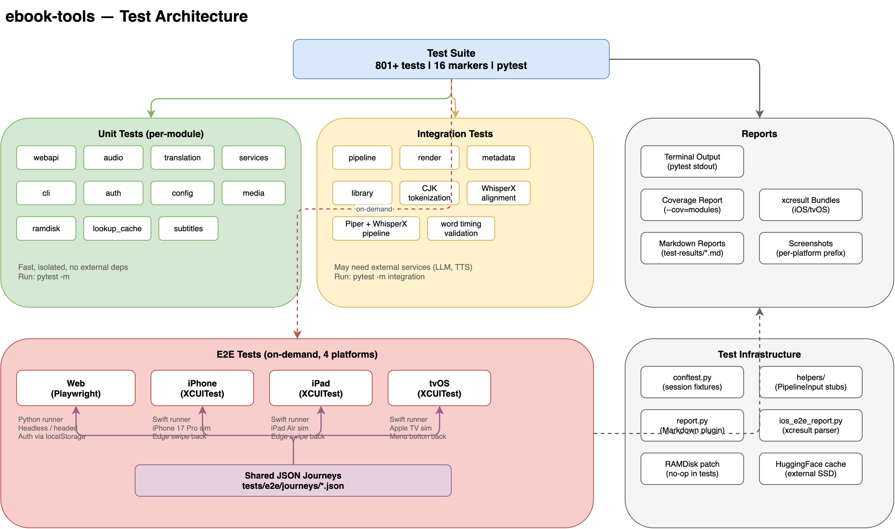

# Testing Guide

## Overview

The ebook-tools project has a comprehensive test suite with **1,300+ tests** that
are fully green (10 skipped). Tests are organized by domain using pytest markers,
enabling fast targeted runs during development. End-to-end tests run on-demand
across **4 platforms**: Web (Playwright), iPhone, iPad, and tvOS (XCUITest).



**Key characteristics:**

- **pytest-based** with custom markers for domain isolation
- **E2E tests excluded by default** (`addopts = "-rs -m 'not e2e'"`)
- **Session-scoped fixtures** prevent real RAMDisk mounts during tests
- **Shared JSON journey architecture** for cross-platform E2E consistency
- **Markdown reports with screenshots** for E2E results

## Running Tests

### Apple Pipeline Smoke

For native Apple build/install/launch smoke tests, use the shared home Apple
pipeline instead of adding another local ebook-tools wrapper:

```bash
cd /Users/fifo/Projects/home/apple-device-app-pipeline
python3 scripts/check_app_source_sync.py --app ebook-tools
python3 scripts/check_app_backend.py --app ebook-tools
python3 scripts/ensure_simulator_fleet.py --app ebook-tools --dry-run
python3 scripts/ensure_simulator_fleet.py --app ebook-tools --download-missing
python3 scripts/run_app_simulator_smoke.py --app ebook-tools --profile ipados
python3 scripts/run_app_simulator_smoke.py --app ebook-tools --profile ios
python3 scripts/run_app_simulator_smoke.py --app ebook-tools --profile tvos

# Attended physical deploy dry runs
python3 scripts/run_app_device_deploy.py --app ebook-tools --profile ipad --signed-build-only
python3 scripts/run_app_device_deploy.py --app ebook-tools --profile ipad --dry-run
python3 scripts/run_app_device_deploy.py --app ebook-tools --profile iphone --dry-run
python3 scripts/run_app_device_deploy.py --app ebook-tools --profile appletv --dry-run
python3 scripts/run_app_device_deploy.py --app ebook-tools --profile cinema --dry-run

# Repo-owned wrappers for the same attended-device gates
make apple-device-preflight APPLE_DEVICE_PROFILE=ipad APPLE_DEVICE_ID=<id>
make apple-device-signed-build-only APPLE_DEVICE_PROFILE=ipad
make apple-device-deploy-dry-run APPLE_DEVICE_PROFILE=appletv
make apple-device-full-entitlement-plan APPLE_DEVICE_ID=<id>
CONFIRM_PHYSICAL_DEVICE_UPDATE=YES \
  make apple-device-full-entitlement-fallback-install \
    APPLE_DEVICE_ID=<id> \
    APPLE_DEVICE_SIGNED_ARTIFACT_PATH=<InteractiveReader.app>
```

The shared pipeline validates the MacBook simulator lane from the local
`/Users/fifo/Projects/home/ebook-tools` clone against the Mac Studio/NAS-hosted
backend topology. It can also repair simulator runtime drift via Xcode platform
downloads when requested. Physical device installs additionally require the
target device to be awake/trusted and Xcode provisioning to cover iCloud, Sign in
with Apple, and Push Notifications. The Makefile targets below remain the
ebook-tools-owned authenticated XCUITest journeys and report generation.
Use `--signed-build-only` to check that physical-device provisioning gate before
attempting an install.

Authenticated Apple journeys should also be launched through the shared
manifest wrapper when dogfooding the home pipeline:

```bash
cd /Users/fifo/Projects/home/apple-device-app-pipeline
python3 scripts/run_app_owned_journey.py --app ebook-tools --list
python3 scripts/run_app_owned_journey.py --app ebook-tools --profile apple-e2e-journeys --use-remote-env
python3 scripts/run_app_owned_journey.py --app ebook-tools --profile ipados --dry-run
python3 scripts/run_app_owned_journey.py --app ebook-tools --profile ipados-create --dry-run
python3 scripts/run_app_owned_journey.py --app ebook-tools --profile tvos-create --dry-run
python3 scripts/run_app_owned_journey.py --app ebook-tools --profile ios-uitests-build --dry-run
python3 scripts/run_app_owned_journey.py --app ebook-tools --profile tvos-uitests-build --dry-run
python3 scripts/run_app_owned_journey.py --app ebook-tools --profile macos-ipad-style-dry-run --dry-run
python3 scripts/run_app_owned_journey.py --app ebook-tools --profile macos-ipad-style --dry-run
python3 scripts/run_app_owned_journey.py --app ebook-tools --profile tvos --use-remote-env
```

The ebook-tools app manifest allowlists only `E2E_USERNAME`, `E2E_PASSWORD`,
`E2E_AUTH_TOKEN`, `EBOOKTOOLS_SESSION_TOKEN`, and `E2E_API_BASE_URL` from the
Mac Studio runtime `.env`. The wrapper redacts sensitive values in its output
and writes profile-scoped XCUITest config under
`/tmp/apple-device-app-pipeline/ebook-tools/{profile}/`. Real iPhone, iPad, and
Apple TV installs remain attended; simulator journeys may use injected test
credentials.

Before any iPhone, iPad, or Apple TV XCUITest run starts, the Makefile also runs
`scripts/check_apple_xcode_readiness.py` against the configured `xcodebuild`.
This catches first-launch or license setup issues early with a clear message
such as running `sudo xcodebuild -license` or `sudo xcodebuild -runFirstLaunch`
on that Mac, instead of launching Xcode and then failing later with a missing
`.xcresult` bundle.

Apple journey JSON is also validated without credentials by
`scripts/check_apple_e2e_journeys.py`. The validator reads the Swift
`JourneyRunner` contract and checks every file in `tests/e2e/journeys` for
handled actions, supported platform names, supported tvOS remote buttons, and
required fields such as selectors and expected text. It also pins the
`music_bed_sync` semantic sequence, including reader transport command counts,
pause/play actions, guard state, reader surface ownership, double-press
debouncing, and fullscreen artwork suppression evidence. This runs in the
Apple contract lane, so changes to journeys fail before simulator credentials
or Xcode are needed.
Web journey JSON is validated without credentials by
`scripts/check_web_e2e_journeys.py`. That validator reads the Playwright
`WebJourneyRunner` actions and ensures every Web-runnable journey or step is
handled by the Web runner, while top-level Apple-only `platforms` scopes keep
native Create and Music-bed journeys out of browser E2E.

For the Apple TV Music-bed transport regression, use the repo-owned simulator
journey. It launches the tvOS app with `E2E_MUSIC_BED_SYNC_TEST=1`, exposes
debug-only status controls, presses the tvOS remote Play/Pause button, and
asserts that the reader sentence transport plus Apple Music bed mirror
pause/resume and stay mirrored. The first remote pause includes a short settled
hold, a guarded second remote Play/Pause press that must stay paused, and a
12.5-second long hold before resume, covering the late tvOS fullscreen Music-art
promotion window after reader-owned pause. It sends a rapid double Play/Pause
press with `count` and `interval_ms`, then checks that only one additional
reader transport action was accepted, and finally returns to the TV menu to
prove the now-playing entry remains navigable. It checks the debug
`readerTransportCommands` counter after each command, `lastAction=pause/play`,
`surface=reader`, and `fullscreen=blocked` while Music is used as the bed, so it
proves Job/Library reader transport command handling, reader surface ownership,
and the tvOS Music artwork suppression path fired, not only the final
MusicKit/Now Playing state.
The iPad branch of the same journey covers the Apple Music bed sentence-transition
stability path. It asserts the reader audio session stays in neutral playback
mixing mode (`sessionStable=true`, `sessionLabel=mixing`) and the DEBUG overlay
counter `autoResumeAlreadyPlaying` reaches at least 1 after the iPad-only
auto-resume probe, so simulator and device debug checks confirm active reader
handoffs are settling an already-playing Apple Music bed instead of issuing a
fresh MusicKit `play()` request on every sentence change. The journey re-checks
`sessionStable=true` and `sessionLabel=mixing` after that probe, then forces a
requested reader sentence-transition pause and asserts `transitionPauses>=1`,
`requested=true`, `reader=paused`, `readerPause=false`, `manual=false`, and
`music=playing` together. That catches the iPad case where Apple Music dips
between sentence tracks while the reader still intends playback. The iPad/iPhone
coordinator path must defer transient active-reading-bed non-playing observations
without adopting the reader-pause path; if MusicKit remains stopped after the
settle window, the active-narration recovery path may resume the bed.
The TV pause path treats foreground Play/Pause, true toggle callbacks, and
direct tvOS Now Playing `play`/`pause` callbacks as state-resolved reader
toggles while Apple Music is only the reading bed. That matches the physical
Apple TV remote even when tvOS delivers the hardware Play/Pause button as an
explicit play callback, without letting MusicKit command-center delivery flip an
already-paused reader before the duplicate window accepts it. The journey runner reads status values without
scrolling/focus presses once the element exists, so timed pause-hold assertions
remain inside the intended hold window. It also keeps MusicKit play-observation suppression
active until reader transport explicitly resumes, with repeated confirmation
checks so a stray or delayed Apple Music resume after reader-owned pause is
re-paused instead of restarting narration or promoting fullscreen Music artwork.
The simulator journey also taps the debug reader `play` command while that
pause guard is active and asserts the reader transport command count stays
unchanged, proving stray Music-surface play callbacks do not resume narration.
The tvOS Music surface guard also runs a live
fullscreen-artwork watchdog while Apple Music is only the reading bed, so device
logs may show `fullscreen artwork suppression watchdog started` and
`fullscreen artwork suppression reasserted` when tvOS or MusicKit resets the idle
surface:

```bash
make test-e2e-ipad-music-bed-sync-dry-run
make test-e2e-ipad-music-bed-sync
make test-e2e-tvos-music-bed-sync-dry-run
make test-e2e-tvos-music-bed-sync
```

Latest Music-bed simulator evidence from June 28, 2026 for
`v2026.06.28.058`: `make test-e2e-ipad-music-bed-sync` passed on iPad Pro
13-inch (M5) Simulator 26.5 with 1 passed / 0 failed / 0 skipped in 35.4s,
and the previous
`make test-e2e-tvos-music-bed-sync` passed on Apple TV 4K (3rd generation)
Simulator 26.5 with 1 passed / 0 failed in 86.4s. Those runs exercised the
iPad already-playing/sentence-transition Music-bed guard, iPad transient
non-playing deferral/recovery contract, immediate iPad reader Space resume after
pause via the shared keyboard shortcut notification path, and the tvOS
Play/Pause hold plus fullscreen-artwork suppression journey after the
iPad/iPhone settle-only sentence handoff fix. They did not touch physical
devices.

Use the dry-run target on machines without E2E credentials or a warm simulator
session. It validates the journey semantics and shared app-owned journey
registration without booting a simulator or reading secrets. The full target
remains the higher-fidelity XCUITest gate; for this Music-bed regression it sets
`E2E_ALLOW_RESTORED_SESSION=1` and `E2E_FAIL_ON_SKIPPED=1`, so skipped XCUITest
cases fail the Make target instead of producing a misleading green report. Apple
E2E config generation also rejects a profile whose inferred platform is not
included in the selected journey's top-level `platforms` list, so an
iPhone/iPad/tvOS profile mismatch fails before Xcode can turn it into a skipped
journey. `make check-apple-e2e-journeys` runs the same scope compatibility check
against the Makefile's Apple E2E profile-to-journey wiring, so shared-pipeline
dry-runs catch mismatched registrations without launching a simulator.
Credentials may be omitted when the simulator already has a valid restored
session. If the simulator has no restored
session and credentials are absent, the journey can also use an injected
`E2E_AUTH_TOKEN` (or `EBOOKTOOLS_SESSION_TOKEN` alias). If no token, restored
session, or credentials work, the journey still fails clearly at the login step
instead of silently passing.

When a physical device feels slow after login or session restore, measure the
authenticated backend path without printing credentials or tokens:

```bash
scripts/check_auth_latency.py --runs 5
```

The script reads `E2E_USERNAME`, `E2E_PASSWORD`, and optional
`E2E_API_BASE_URL` from the environment or `.env`, then reports only HTTP
status and elapsed time for `/api/auth/login` and `/api/auth/session`. On
June 21, 2026, the Mac Studio runtime check against the NAS-routed public API
showed login after warmup at roughly 23-31 ms and session restore at roughly
18-24 ms, so the observed attended-device login sluggishness should be
investigated in app launch/debugger/UI sequencing before backend routing.

The Apple Make targets also use the same `tempfile.gettempdir()`-scoped
simulator mutation lock as the shared pipeline while `xcodebuild test` is
running. This keeps app-owned XCUITest journeys from racing with shared
simulator smokes that boot, install, launch, or shut down devices during
parallel dogfood runs.

`make test-changed` routes `.gitignore`, Makefile, testing documentation, the
active cross-surface parity plan, and shared pipeline contract edits to
`test-makefile-contract`. That lane protects build/test target wiring plus
tracked artifact rules such as the Web offline export player bundle, so
source-sync and export packaging changes do not slide through the generic fast
suite.
Apple E2E preflight script changes, including `scripts/check_apple_e2e_config.py`,
route to `test-apple-contracts` so simulator credential/config validation stays
covered by the Apple gate. Mac Studio runtime helper changes, including
`scripts/check_mac_studio_runtime_checkout.sh` and
`scripts/fast_forward_mac_studio_runtime_checkout.sh`, also route to the Apple
contract lane because they guard the golden pipeline source-sync handoff.
Discovery/acquisition plan, provider, schema, and route changes route to
`test-backend-acquisition`, keeping Web and Apple Create source discovery,
prepared-artifact handoff, and token-safe provider serialization covered by the
dedicated backend slice before simulator journeys consume those contracts.
Release metadata edits, including `CHANGELOG.md`, Apple app plists, Xcode build
version settings, `AppChangelogData.swift`, `AppVersion.swift`, and
`scripts/check_release_version_contract.py`, route to `test-release-version`;
when those files also live under `ios/`, `test-changed` additionally runs the
Apple contract lane.

Current iPad M5 deployment gate:

The authenticated iPadOS simulator journey is green through the shared pipeline:

```bash
python3 scripts/run_app_owned_journey.py --app ebook-tools --profile ipados --use-remote-env
```

Run the Apple Create readiness preflight before authenticated Create journeys
against a shared backend:

```bash
python3 scripts/check_apple_create_readiness.py --env-file .env.local
```

The Make targets choose `E2E_ENV_FILE` automatically: `.env` when present,
otherwise `.env.local`, with an explicit override available for one-off runs.

The reusable manifest also exposes stricter native Create journeys as
`iphone-create` and `ipados-create`. They run the same preflight before Xcode
and then execute the `create_readiness.json` journey, which verifies generated
book controls and source-book continuation fields plus Narrate EPUB, subtitle,
and YouTube dubbing defaults from backend-visible sources.

The preflight verifies backend-visible EPUBs, chapter-index loading for the
preferred newest EPUB, subtitle sources, newest playable YouTube/NAS video
subtitle pairs (`ASS`, `SRT`, `VTT`, or `SUB` sidecars), generated-book
sentence/language/voice defaults, the broad book language inventory, and the
shared subtitle/YouTube dubbing processing defaults from `/api/books/options`.
It also validates that `/api/pipelines/defaults` returns the shared Web
pipeline-defaults config shape, that `/api/creation/templates` returns the
shared saved template list shape even when the user has no saved templates, and
that `/api/acquisition/providers` advertises the provider ids, book/video media
kinds, capabilities, and attended Z-Library policy expected by the Web and
Apple discovery pickers. It checks both explicit-provider discovery routes and
the no-provider Default sources fan-out used by Web and Apple pickers, while
keeping `youtube_url` explicit-only. It also derives a token-safe Download
Station handoff readiness check from the same registry, requiring searchable
Newznab/Torznab metadata plus Download Station acquire/poll capabilities before
Apple/Web video discovery can treat indexer results as server-side downloader
handoff candidates. It also validates that `/api/pipelines/intake/status`
returns the queue/backpressure shape consumed by Web and Apple Create. It checks
both the live subtitle model route and the shared pipeline LLM model route plus
the audio voice inventory endpoint by aggregate shape so picker regressions are
caught without logging model or voice names. It also posts an empty image-node
availability request to validate the shared Draw Things availability response
shape without probing configured image URLs. It fails if the Create contract
regresses to a small language list,
including the iPad-visible six-language regression, if the preferred EPUB
cannot drive the Apple Load Chapters flow, if saved-template reuse disappears,
if the shared pipeline defaults or intake status stop decoding, if picker
inventories stop decoding, if image availability stops decoding, or if the
backend stops advertising the generated-book or media-job defaults used by Web
and Apple creation forms. The native Create readiness contracts also pin the
Apple Narrate EPUB picker to tolerant server-EPUB
candidate filtering so older or partial file-type metadata does not hide
backend-visible `.epub` entries on iPhone or iPad. The native Create readiness
journey opens Narrate EPUB discovery, selects the backend-driven attended
Z-Library provider, and asserts the disabled-policy message before continuing.
It also selects `Hindi` in the target-language picker so the full Web-backed
language catalog is exercised in the simulator UI, not only the backend
contract. It toggles generated-book illustrations when needed and
asserts the image-node availability action is visible, so simulator coverage
reaches the shared image-generation settings without probing configured image
URLs.

Latest result on June 21, 2026: `InteractiveReaderUITests/JourneyTests/testJourney`
passed on the `iPad Pro 13-inch (M5)` simulator with 1 test, 0 failures. The
journey asserts the visible `appVersionBadge` frame so the pipeline rejects the
narrow/vertical version-pill regression that was seen on the physical iPad.

Device preflight currently sees `Fifo Ipad Pro` through CoreDevice:

```bash
python3 scripts/run_app_device_deploy.py --app ebook-tools --profile ipad --device-preflight-only
```

For the repo-owned local macOS Designed for iPad/iPhone destination, use the
non-deploying helper checks before a compile:

```bash
make apple-macos-ipad-destination
make build-apple-macos-ipad-style-dry-run
make build-apple-macos-ipad-style
```

The shared pipeline exposes the same lane as the `macos-ipad-style-dry-run`
and `macos-ipad-style` app-owned profiles, mapping to the dry-run and compile
targets above. These commands resolve the local Mac destination and app product
path without touching physical iPhone/iPad/Apple TV devices.

To compile every repo-owned Apple surface that does not touch physical
hardware, use the aggregate local build gate:

```bash
make build-apple-local-surfaces
```

This chains the iPhone simulator, iPad simulator, tvOS simulator, and local Mac
Designed for iPad/iPhone compile checks. It is the preferred local gate before
requesting an attended physical-device deploy.

When the active hardware lane is office-iPad-only and the iPhone is
unavailable, use the narrower iPad/local-Mac build gate:

```bash
make build-apple-office-ipad-surfaces
```

This chains the iPad simulator build with the local Mac Designed for
iPad/iPhone compile check and avoids the iPhone simulator and all physical
device update helpers.

To run the Apple contract gate and then compile every non-physical Apple
surface, use the aggregate local verification gate:

```bash
make verify-apple-local-surfaces
```

This is the preferred repo-owned Apple preflight before requesting an attended
iPhone, iPad, Apple TV, or local Mac Designed for iPad/iPhone update.

To verify the Web UI/export player and all non-physical Apple surfaces from one
repo-owned checkpoint, use:

```bash
make verify-apple-cross-surface-checkpoint
```

This runs the shared backend manifest slices, including auth/session,
Library/Search/source, admin/system, runtime descriptor, Create, pipeline
source, acquisition, audio, reading beds, notifications, subtitle,
playback-state/media, offline export, and YouTube dubbing; the manifest
registered focused Web checks plus full Vitest and production/export Web build;
and then the Apple local verification gate. It is the preferred safe checkpoint
before pushing or before an explicit attended device deploy request when Web
and Apple surfaces changed.

For office-iPad-only iteration, use the matching verification gate:

```bash
make verify-apple-office-ipad-surfaces
```

This runs the Apple contracts, the iPad simulator build, the iOS UITest
build-for-testing lane on the iPad destination, and the local Mac Designed for
iPad/iPhone compile check without requiring an iPhone.

The reusable Apple device app pipeline can also be driven from this checkout
through repo-owned wrapper targets:

```bash
make apple-pipeline-contracts
make test-release-version
make test-apple-language-catalogs
make test-apple-create-readiness-contract
make test-apple-local-surface-contract
make apple-pipeline-backend
make apple-pipeline-backend-tests
make apple-pipeline-source-sync
make apple-pipeline-web-checks
make apple-pipeline-simulator-smoke-dry-run
make apple-pipeline-simulator-smokes-dry-run
make apple-pipeline-owned-journeys-list
make apple-pipeline-owned-journeys
make apple-pipeline-owned-journey-dry-run APPLE_PIPELINE_JOURNEY_PROFILE=apple-e2e-journeys
make apple-pipeline-owned-journey-dry-run
make apple-pipeline-owned-journeys-dry-run
make apple-pipeline-ipad-create-readiness
make apple-pipeline-ipad-create-readiness-dry-run
make apple-pipeline-tvos-create-readiness
make apple-pipeline-tvos-create-readiness-dry-run
make apple-pipeline-owned-journey-dry-run APPLE_PIPELINE_JOURNEY_PROFILE=tvos-uitests-build
make apple-pipeline-owned-journey-dry-run APPLE_PIPELINE_JOURNEY_PROFILE=ipados-music-bed-sync
make apple-pipeline-owned-journey-dry-run APPLE_PIPELINE_JOURNEY_PROFILE=tvos-music-bed-sync
make apple-pipeline-owned-journey-dry-run APPLE_PIPELINE_JOURNEY_PROFILE=runtime-xcode-readiness
make apple-pipeline-orchestration-dry-runs
make apple-runtime-fast-forward
make apple-runtime-ssh-check
make apple-runtime-xcode-readiness
make verify-apple-shared-pipeline
make verify-apple-dogfood-pipeline
make verify-apple-golden-pipeline
```

`apple-runtime-fast-forward` uses BatchMode SSH to fast-forward the remembered
Mac Studio runtime checkout with `git pull --ff-only` after refusing dirty
remote worktrees or unexpected branches. After the pull it prunes only
untracked, unreferenced export-player JS orphans from
`web/export-dist/assets/`, then fails if any other local change remains.
`apple-runtime-ssh-check` verifies
`fifo@192.168.1.9:/Users/fifo/Projects/home/ebook-tools` is reachable, clean,
on `main`, and at the same Git head as the local checkout. It does not pull,
build, install, or launch anything. Neither helper touches physical devices.
`apple-runtime-xcode-readiness` SSHes into that same runtime checkout and runs
`scripts/check_apple_xcode_readiness.py`, which probes `xcodebuild -license check`
before first-launch status so a golden Mac with an unaccepted Xcode license or
unfinished first-launch tasks fails before source-sync or simulator journeys
with the right remediation command.
When this fails with "Xcode license is not accepted" and `sudo -n xcodebuild`
reports "a password is required", the golden path is waiting for an attended
Mac Studio admin action: run `sudo xcodebuild -license` or
`sudo xcodebuild -runFirstLaunch` on that Mac, then rerun
`make apple-runtime-xcode-readiness`. The fast-forward and source-sync checks
can still pass in this state; they only prove the runtime clone is clean and at
the expected Git head.
`verify-apple-shared-pipeline` runs the shared pipeline contract, backend
health/runtime, backend pytest, Web checks, and simulator/journey orchestration
dry-runs without physical deployment. Run
`apple-pipeline-source-sync` after the Mac Studio/runtime checkout has been
fast-forwarded, because that check compares the local and remote Git state.
`verify-apple-dogfood-pipeline` layers the local Web/Apple cross-surface
checkpoint before `verify-apple-shared-pipeline`, keeping the reusable pipeline
and repo-owned surface gates together without touching physical devices. When
that runtime SSH check and source-sync check are expected to pass,
`verify-apple-golden-pipeline` runs the fast-forward, SSH check, and source-sync
steps, plus the remote Xcode readiness preflight, in front of
`verify-apple-dogfood-pipeline` while still avoiding physical-device
deployment.
`apple-pipeline-backend-tests` runs the manifest registered repo-owned
`make test-backend-*` pytest targets and cleans generated caches.
`apple-pipeline-web-checks` runs the
manifest registered Web focused checks and production/export build through the
shared pipeline runner. The focused Sidebar, Create, saved-template, Library,
Job Progress, Playback, Video Dubbing, Subtitle Tool, app-view deeplink, full
Vitest, and production/export build checks are repo-owned Web targets, so the
shared manifest only names stable app commands before restoring generated Web
artifacts. Use
`APPLE_PIPELINE_SMOKE_PROFILE=ios|ipados|tvos` with
`apple-pipeline-simulator-smoke-dry-run` before launching a shared simulator
smoke. Use `apple-pipeline-ipad-create-readiness-dry-run`, then
`apple-pipeline-ipad-create-readiness`, for the office-iPad-only Create
readiness lane; it delegates to the registered `ipados-create` app-owned
journey. Use `apple-pipeline-tvos-create-readiness-dry-run`, then
`apple-pipeline-tvos-create-readiness`, when Apple TV Create needs the same
strict backend-source readiness check through the registered `tvos-create`
journey. Use `APPLE_PIPELINE_JOURNEY_PROFILE=tvos-uitests-build` to dry-run the
credential-free tvOS UI-test compile profile through the shared wrapper. Use
`APPLE_PIPELINE_JOURNEY_PROFILE=apple-e2e-journeys` with
`apple-pipeline-owned-journey-dry-run`, or `make check-apple-e2e-journeys`
directly, to validate all Apple JSON journeys against the Swift journey runner
without credentials, simulator boot, or backend login state. Use
`APPLE_PIPELINE_JOURNEY_PROFILE=ipados-music-bed-sync` or
`APPLE_PIPELINE_JOURNEY_PROFILE=tvos-music-bed-sync` with
`apple-pipeline-owned-journey-dry-run` to verify the iPad session-stability and
Apple TV transport Music-bed regressions are registered before running the live
simulator journeys.
Use `APPLE_PIPELINE_JOURNEY_PROFILE=runtime-xcode-readiness` with
`apple-pipeline-owned-journey-dry-run` to verify the Mac Studio Xcode
first-launch/license preflight remains registered before the golden pipeline
runs it for real.
Use `make apple-pipeline-owned-journeys-list` to inspect registered
app-owned journeys without launching one; `make apple-pipeline-owned-journeys`
is kept as a compatibility alias for the same list command. Use
`APPLE_PIPELINE_JOURNEY_PROFILE=ipados-create` or
`tvos-create` with `apple-pipeline-owned-journey-dry-run` when you need an
explicit profile override. `apple-pipeline-orchestration-dry-runs` expands the
registered iPhone/iPad/tvOS simulator smoke profiles, lists app-owned journeys,
and dry-runs each app-owned journey without booting simulators or loading
remote secrets.

Latest shared-pipeline dogfood evidence from June 28, 2026:
`make verify-apple-shared-pipeline` passed from the ebook-tools checkout at
commit `aa29838d`. The run covered manifest-driven Apple contracts, live backend
health/runtime checks, all registered backend pytest slices, Web focused/full
Vitest checks, production/export builds, iPhone/iPad/tvOS simulator-smoke
dry-runs, registered app-owned journey listing, and every app-owned journey
dry-run including `apple-e2e-journeys`, `ipados-music-bed-sync`,
`tvos-music-bed-sync`, iPhone/iPad/TV Create readiness, UI-test build, runtime
Xcode readiness, and Mac iPad-style profiles. The `ipados-music-bed-sync`
dry-run included the iPad sentence-transition guard that asserts
`transitionPauses>=1` while Music stays playing. The full run did not boot
simulators, load remote secrets for credential-free validation, or touch
physical devices.
Golden-pipeline preflight evidence from the same date at commit `5263d452`:
`make apple-runtime-fast-forward`, `make apple-runtime-ssh-check`, and
`make apple-pipeline-source-sync` passed, proving the Mac Studio runtime clone
matched the local head. `make apple-runtime-xcode-readiness` failed before any
device or simulator work because the Mac Studio Xcode license/first-launch state
requires attended sudo remediation.

For a quick Apple TV compile check without launching the full tvOS journey, run
the repo-owned simulator build lane:

```bash
make build-apple-tvos-simulator
make build-apple-tvos-uitests
```

This compiles the `InteractiveReaderTV` scheme for the default Apple TV 4K
simulator destination. `build-apple-tvos-uitests` compiles the
`InteractiveReaderTVUITests` scheme with `build-for-testing`, so tvOS journey
runner changes can be checked without E2E credentials or launching the full
XCUITest journey. Both write DerivedData under `test-results/`, without
installing to Apple TV hardware.

For iPhone/iPad compile checks without launching the full XCUITest journeys,
run the matching repo-owned simulator build lanes:

```bash
make build-apple-iphone-simulator
make build-apple-ipad-simulator
make build-apple-ios-simulators
make build-apple-ios-uitests
make build-apple-tvos-uitests
```

These compile the shared `InteractiveReader` scheme for the default iPhone and
iPad simulator destinations. `build-apple-ios-uitests` and
`build-apple-tvos-uitests` compile their UI-test schemes with
`build-for-testing` so journey-runner changes can be checked without launching
the full XCUITest journeys. All write DerivedData under `test-results/` without
installing to physical hardware.

For repo-owned physical iPhone/iPad update readiness, the guarded helper can
exercise CoreDevice paths without installing:

```bash
make apple-devices
APPLE_DEVICE_ID="Fifo Ipad Pro" bash scripts/apple_unattended_device_update.sh --device-preflight-only
APPLE_DEVICE_ID="Fifo Ipad Pro" bash scripts/apple_unattended_device_update.sh --verify-installed
APPLE_DEVICE_ID="Fifo Ipad Pro" bash scripts/apple_unattended_device_update.sh --build-only --allow-provisioning-updates
```

`--device-preflight-only` checks that CoreDevice can see and query the selected
device without requiring the app to already be installed. `--verify-installed`
is the separate installed-app metadata check, and confirmed installs run the
device preflight before build/install unless `--no-preflight` is passed.

The reusable Apple device pipeline also calls the repo-owned
`src/check_poc_readiness.py` hook before signed build/install when readiness is
not skipped. Despite the legacy filename, the ebook-tools hook is intentionally
token-safe: it checks `/_health` and `/api/system/runtime`, then verifies that
the public runtime descriptor advertises the Apple Create, Library action,
offline export, and playback-state paths used by iPhone, iPad, macOS
iPad-style, and tvOS surfaces; its success summary also counts the acquisition
Create routes used for provider discovery, artifact preparation, and async
Download Station job polling. It accepts the shared helper's
legacy flags (`--use-remote-env-tokens`, read/write token requirements, and
`--skip-apple-build`) so iPad/TV update runs can reuse the same unattended
command shape while the unavailable iPhone profile is left out of the run. The
backend test manifest separately covers auth/session restore, reading-bed
catalog and uploaded file route used by Web playback controls plus Apple
playback/offline sync, playback media manifests/file streaming, and the
notification device/preference/test routes used by Apple Settings.

Run the local Apple contract gate after changing native Create payloads,
deployment helpers, or simulator journey config wiring:

```bash
make test-apple-contracts
```

This first runs `make test-release-version`, then checks backend/Web/Apple
language catalogue parity, iPad Create split-view layout wiring, the public
runtime descriptor contract, preflight/config parsing, the Swift creation
payload contract, the macOS iPad-style build helper, the
iPhone/iPad simulator compile lanes, the tvOS simulator compile lane, the
office-iPad local build/verification gates, the local Apple surface build gate,
the local Apple verification gate, the
repo-owned Apple deploy readiness hook, the guarded
physical-device update helper, the shared Apple pipeline preflight targets, and
the XCUITest config writer without installing to iPhone, iPad, or Apple TV
hardware.

For focused language picker/catalog work, use:

```bash
make test-apple-language-catalogs
```

This runs the backend/Web/Apple catalog parity tests, the catalog generator
tests, and the generator staleness check without invoking the full Apple
contract suite.

For focused Apple Create readiness preflight work, use:

```bash
make test-apple-create-readiness-contract
```

This runs the native Create readiness checker tests plus the simulator-journey
and env-file contracts that prove the preflight is wired before iPhone, iPad,
and tvOS Create journeys.

For focused non-physical Apple build surface wiring, use:

```bash
make test-apple-local-surface-contract
```

This checks the iPhone/iPad simulator build lanes, tvOS simulator build lane,
Mac Designed for iPad helper, and aggregate local/office-iPad surface gates
without compiling or installing apps.

The public runtime descriptor at `/api/system/runtime` also advertises the
Create, saved-template, shared defaults/model/voice picker, image-node
availability, Jobs action, Library action, playback media, linguist,
offline export, playback-state, and notification endpoints used by Apple
surfaces. The reusable pipeline backend check validates those fields before
simulator or device runs, and the Apple Settings screen exposes matching
readiness rows, so an older deployment fails early without needing credentials.

Use dry-runs to inspect the exact unattended command sequence before a physical
update:

```bash
APPLE_DEVICE_ID="Fifo Ipad Pro" bash scripts/apple_unattended_device_update.sh --install --dry-run
APPLE_DEVICE_ID="Fifo Ipad Pro" CONFIRM_PHYSICAL_DEVICE_UPDATE=YES \
  bash scripts/apple_unattended_device_update.sh --install --launch --dry-run
```

Actual physical installs remain explicit and attended by policy:

```bash
APPLE_DEVICE_ID="Fifo Ipad Pro" CONFIRM_PHYSICAL_DEVICE_UPDATE=YES \
  bash scripts/apple_unattended_device_update.sh --install
```

After install, the helper runs `devicectl device info apps --bundle-id` with a
JSON output file under `test-results/` and fails if installed app metadata for
`com.example.InteractiveReader` is not found. Add `--launch` only when the
device is awake and unlocked; locked devices can still install and verify
metadata, but foreground launch may block until the user unlocks the device.
When a signed app has already been produced by Xcode or a prior build, use
`--skip-build --app-path /path/to/InteractiveReader.app` with the same
confirmation guard to install that bundle without driving Xcode again. Add
`--fallback-to-signed-artifact` on that direct skip-build path when the app is
the current full-entitlement release artifact; the helper verifies the bundle
signature plus current bundle id/version/build before running CoreDevice
preflight or installing, so stale cached artifacts fail before touching the
device.
If a confirmed install build fails because command-line Xcode cannot access the
signed-in account or full-capability profile, keep the deploy unattended by
adding `--fallback-to-signed-artifact --signed-artifact-path <app>`. The helper
verifies the fallback bundle signature plus current bundle id/version/build
before swapping the install path, so stale or partially signed artifacts fail
before `devicectl install`.
After a verified install, a locked iPhone or iPad launch denial is reported as a
lock-screen condition rather than a failed deployment; app crashes and other
launch failures still fail the helper.

The Makefile shortcut for the remembered latest-stable recipe is:

```bash
CONFIRM_PHYSICAL_DEVICE_UPDATE=YES \
  make apple-device-full-entitlement-stable-install \
    APPLE_DEVICE_PROFILE=ipad \
    APPLE_DEVICE_ID="Fifo Ipad Pro" \
    APPLE_DEVICE_SIGNED_ARTIFACT_PATH=test-results/DerivedData-device-full-entitlements/Build/Products/Debug-iphoneos/InteractiveReader.app
```

Use the fallback variant when you want the helper to try Xcode first and only
swap to the signed artifact after a CLI signing failure:

```bash
CONFIRM_PHYSICAL_DEVICE_UPDATE=YES \
  make apple-device-full-entitlement-fallback-install \
    APPLE_DEVICE_PROFILE=ipad \
    APPLE_DEVICE_ID="Fifo Ipad Pro" \
    APPLE_DEVICE_SIGNED_ARTIFACT_PATH=test-results/DerivedData-device-full-entitlements/Build/Products/Debug-iphoneos/InteractiveReader.app
```

It still requires an explicit physical-device deploy request and the
`CONFIRM_PHYSICAL_DEVICE_UPDATE=YES` guard. Override
`APPLE_DEVICE_LAUNCH_CONSOLE_TIMEOUT` when a longer crash-watch window is
needed after install.

Latest iPad Pro arrow-key validation deploy from June 27, 2026 used the
full-entitlement install helper with `APPLE_DEVICE_PROFILE=ipad`,
`APPLE_DEVICE_ID=BC4A8986-54B2-543C-83CB-4B28F4F73BB2`, and
`APPLE_DEVICE_LAUNCH_CONSOLE_TIMEOUT=10`. The post-install `devicectl`
verification reported:

```text
InteractiveReader   com.example.InteractiveReader   2026.6.27   20260627001
```

The launch console showed remote notification registration and reached the
10-second timeout, which was treated as the app-alive crash-watch signal.

For Apple Music reading-bed Control Center checks, keep the same launch-console
path and inspect the token-safe `NowPlaying` / `MusicKit` breadcrumbs. A healthy
handoff should show Apple Music entering `appleMusicBed`, reader remote commands
enabled, and reader Now Playing transport metadata (`playing` or `paused`) plus
playback rate being published after the MusicKit transition. Current reader
ownership also reasserts the narration mixing session in its current
mixing mode before forced reader snapshots from MusicKit changes and narration
playback-state changes, then binds the active sentence `AVPlayer` to
`MPNowPlayingSession`; reattaching the same player republishes the stored reader
metadata so autoplay can reclaim Control Center after Music starts. Successful
Apple Music play/resume paths also emit delayed `reader-reassert` MusicKit
surface revisions so the reader can publish after MusicKit's own Now Playing
handoff. Reader-owned pause paths should keep fullscreen-artwork suppression
active without starting reader Now Playing reassertion loops until an explicit
reader play/resume command arrives. Observed system Music pauses during an
active Apple Music reading bed should adopt the same reader-owned pause guard,
including stale resume cancellation, tvOS surface suppression, and pause
confirmation breadcrumbs, instead of only mirroring narration into a paused
state. While that guard is active, stray Now Playing `play` and toggle callbacks
that resolve to play are ignored with a `reader-pause-guard` breadcrumb; the
foreground TV Play/Pause toggle is guarded during reader-owned pause just like Now Playing callbacks. Device evidence should show
`Reader NowPlaying session attached player=true` followed by
`Reader NowPlaying session active=true canBecomeActive=true` and
`Reader NowPlaying session reassert requested`. The
app does not call the private-entitlement-gated MediaRemote playback-state
setter; these logs intentionally avoid book text, titles, artists, and media
URLs so they can stay attached to device deployment evidence.
Use the repo-owned launch-console helper rather than a hand-written
`devicectl launch` command for repro captures: it terminates and relaunches the
app, attaches console output, tees the live stream, and persists the result to
`test-results/apple-device-launch-console-<device>.log` (or
`APPLE_DEVICE_LAUNCH_LOG`) so Play/Pause presses are reviewable after the
session times out. CoreDevice's raw `--log-output` is kept beside it as
`*.coredevice.log` and merged into the public log. Validate the persisted
breadcrumbs with:

```bash
make apple-device-verify-music-bed-launch-log \
  APPLE_DEVICE_ID="Living Room Apple TV"
```

For a manual Play/Pause repro capture that should include reader-owned Music
pause plus tvOS Music surface suppression/reassertion evidence, run the same verifier with
`APPLE_MUSIC_BED_LAUNCH_LOG_MODE=pause-release`. The verifier reports missing
breadcrumb categories without dumping the raw launch log, keeping the evidence
token-safe. In pause-release mode it now requires the
`fullscreen artwork suppression watchdog started` breadcrumb so a log proves the
live tvOS guard was armed, not just that the initial suppression flag flipped.
Use `APPLE_MUSIC_BED_LAUNCH_LOG_MODE=guarded-play` for captures that also
exercise a stray Now Playing play callback while paused; that mode additionally
requires the `reader-pause-guard` breadcrumb. The shortcut
`make apple-device-verify-music-bed-guarded-play-log APPLE_DEVICE_ID=<device>`
runs the same guarded-play validation.

Latest Apple TV Music-bed validation deploy from June 27, 2026 installed commit
`79421062` on Living Room Apple TV with:

```bash
CONFIRM_PHYSICAL_DEVICE_UPDATE=YES \
  bash scripts/apple_unattended_device_update.sh \
    --profile appletv \
    --device 5E147DC8-5206-5EF2-A472-5748F7CDF7B0 \
    --install \
    --launch \
    --launch-console-timeout 10 \
    --allow-provisioning-updates
```

`devicectl` verified `InteractiveReaderTV com.example.InteractiveReader.tvos`
at `2026.6.27` build `20260627001`. The launch console showed reader Now
Playing attached, `active=true canBecomeActive=true`, MusicKit restored the
persisted reading-bed queue, entered `appleMusicBed`, and reader transport
published/reasserted active playback before the 10-second app-alive timeout.

After a build is already installed, capture those breadcrumbs without another
deploy by relaunching the app with console attached:

```bash
APPLE_DEVICE_ID="Fifo Ipad Pro" \
APPLE_DEVICE_LAUNCH_CONSOLE_TIMEOUT=60 \
CONFIRM_PHYSICAL_DEVICE_UPDATE=YES \
  make apple-device-launch-console
```

Earlier attended iPad Pro deployment from June 24, 2026: `v2026.06.24.27`
with marketing version `2026.6.24` and bundle version `2026062427`. The
post-install `devicectl` verification reported:

```text
InteractiveReader   com.example.InteractiveReader   2026.6.24   2026062427
```

That install is now captured by
`make apple-device-full-entitlement-stable-install` and used the verified
`test-results/DerivedData-device-full-entitlements/Build/Products/Debug-iphoneos/InteractiveReader.app`
artifact and the unattended `--skip-build --app-path ... --install --launch
--launch-console-timeout 10` path; the launch console timeout was treated as
success after the app stayed alive through the crash-watch window.

Earlier June 22 `.12` installs used the shared pipeline's iPad simulator gate plus Xcode's
GUI `InteractiveReader` scheme and `Fifo Ipad Pro` run destination. The shared
CLI deploy wrapper reached the signed device build but failed because
command-line Xcode account/profile state rejected the app capabilities; the GUI
path used the active Xcode session and installed the bundle. If the iPad is
unlocked, relaunch outside the debugger with:

```bash
xcrun devicectl device process launch \
  --device BC4A8986-54B2-543C-83CB-4B28F4F73BB2 \
  --terminate-existing \
  com.example.InteractiveReader
```

The June 22 `.12` install completed while the iPad was locked; CoreDevice
verified the installed bundle metadata, but Xcode could not launch into a debug
session until the device was unlocked. After metadata verification, cancel the
blocked Xcode launch sheet so the app is not left attached to a stalled
debugger. Keep the iPad awake and unlocked for launch verification; for future
attended installs, prefer USB-C, tap Trust when prompted, then re-enable network
deployment from Xcode Devices and Simulators if needed.

June 24, 2026 iPad/iPhone full-entitlement deploy recipe: when Xcode CLI
automatic signing reported `No Accounts: Add a new account in Accounts
settings` plus missing Push Notifications, Sign in with Apple, and iCloud
capabilities, the successful unattended fallback was to keep entitlements and
sign the built bundle locally. First confirm the cached profiles are capable:

```bash
python3 scripts/ios_profile_capability_check.py \
  --bundle-id com.example.InteractiveReader \
  --entitlements ios/InteractiveReader/InteractiveReader/Supporting/InteractiveReader.entitlements \
  --embedded-bundle-id com.example.InteractiveReader.NotificationServiceExtension
```

Then ask the repo-owned planner to print the unsigned build, profile embedding,
codesign, verify, and guarded skip-build install commands:

```bash
make apple-device-full-entitlement-plan \
  APPLE_DEVICE_ID="<device-id-or-name>"
```

The planner auto-discovers compatible profiles from Xcode's local provisioning
profile caches and auto-selects the only valid local `Apple Development:`
signing identity. Set `APPLE_DEVELOPMENT_IDENTITY`,
`FULL_CAPABILITY_IOS_PROFILE`, `WILDCARD_IOS_EXTENSION_PROFILE`, or
`APPLE_PROVISIONING_PROFILE_DIRS` only when you need to override that selection.

The planner is dry by default. To run the same full-entitlement build, profile
embedding, merged-entitlements generation, signing, and verification flow
without touching a device, use:

```bash
make apple-device-full-entitlement-build \
  APPLE_DEVICE_ID="<device-id-or-name>"
```

Only after an explicit physical-device deploy request, add the guarded install
handoff:

```bash
CONFIRM_PHYSICAL_DEVICE_UPDATE=YES \
  make apple-device-full-entitlement-install \
  APPLE_DEVICE_ID="<device-id-or-name>"
```

If the app has already been signed with the full-capability profiles and the
next deploy only needs to reuse that verified artifact, use:

```bash
CONFIRM_PHYSICAL_DEVICE_UPDATE=YES \
  make apple-device-full-entitlement-fallback-install \
  APPLE_DEVICE_ID="<device-id-or-name>" \
  APPLE_DEVICE_SIGNED_ARTIFACT_PATH=test-results/DerivedData-device-full-entitlements/Build/Products/Debug-iphoneos/InteractiveReader.app
```

The generated plan follows this sequence:

```bash
DERIVED="test-results/DerivedData-device-manual-codesign"
APP="$DERIVED/Build/Products/Debug-iphoneos/InteractiveReader.app"
APPEX="$APP/PlugIns/NotificationServiceExtension.appex"

/Applications/Xcode.app/Contents/Developer/usr/bin/xcodebuild \
  -project ios/InteractiveReader/InteractiveReader.xcodeproj \
  -scheme InteractiveReader \
  -configuration Debug \
  -destination 'generic/platform=iOS' \
  -derivedDataPath "$DERIVED" \
  CODE_SIGNING_ALLOWED=NO \
  build

cp "$FULL_CAPABILITY_IOS_PROFILE" "$APP/embedded.mobileprovision"
cp "$WILDCARD_IOS_EXTENSION_PROFILE" "$APPEX/embedded.mobileprovision"

python3 scripts/apple_merge_entitlements.py \
  --profile "$FULL_CAPABILITY_IOS_PROFILE" \
  --bundle-id com.example.InteractiveReader \
  --project-entitlements ios/InteractiveReader/InteractiveReader/Supporting/InteractiveReader.entitlements \
  --output "$DERIVED/MergedEntitlements/InteractiveReader.entitlements.plist"
python3 scripts/apple_merge_entitlements.py \
  --profile "$WILDCARD_IOS_EXTENSION_PROFILE" \
  --bundle-id com.example.InteractiveReader.NotificationServiceExtension \
  --output "$DERIVED/MergedEntitlements/NotificationServiceExtension.entitlements.plist"

find "$APPEX" -maxdepth 1 -type f -name '*.dylib' -print0 \
  | xargs -0 -I{} /usr/bin/codesign --force --sign "$APPLE_DEVELOPMENT_IDENTITY" --timestamp=none "{}"
/usr/bin/codesign --force --sign "$APPLE_DEVELOPMENT_IDENTITY" --timestamp=none \
  --entitlements "$DERIVED/MergedEntitlements/NotificationServiceExtension.entitlements.plist" "$APPEX"
find "$APP" -maxdepth 1 -type f -name '*.dylib' -print0 \
  | xargs -0 -I{} /usr/bin/codesign --force --sign "$APPLE_DEVELOPMENT_IDENTITY" --timestamp=none "{}"
/usr/bin/codesign --force --sign "$APPLE_DEVELOPMENT_IDENTITY" --timestamp=none \
  --entitlements "$DERIVED/MergedEntitlements/InteractiveReader.entitlements.plist" "$APP"
/usr/bin/codesign --verify --deep --strict --verbose=4 "$APP"

APPLE_DEVICE_ID="<device-id-or-name>" \
APPLE_DEVICE_APP_PATH="$APP" \
CONFIRM_PHYSICAL_DEVICE_UPDATE=YES \
  bash scripts/apple_unattended_device_update.sh \
  --skip-build --install --launch --launch-console-timeout 10
```

For the June 24 `.27` iPad Pro install, `APPLE_DEVICE_ID="Fifo Ipad Pro"`
worked for CoreDevice preflight but not as an `xcodebuild` destination id; the
helper now resolves friendly names through `devicectl device info details` and
passes the hardware UDID (`00008142-001C71AE3AC2401C`) to `xcodebuild`.
The successful manual signing pass used `scripts/apple_merge_entitlements.py`
for both bundles. The app entitlements combine the project iCloud/Push/Sign in
with Apple values with profile-generated `application-identifier`,
`com.apple.developer.team-identifier`, `get-task-allow`, and
`keychain-access-groups`, and replace the placeholder ubiquity kvstore value
with `3Y7288895K.com.example.InteractiveReader`. The notification extension
is signed with its own `application-identifier`, team id, `get-task-allow`,
and keychain group. Signing the app only with
`InteractiveReader.entitlements` passes local `codesign --verify` but fails
device install with `0xe8008015`.

For Apple TV local dry-runs, use the repo-owned profile instead of manually
overriding scheme, bundle id, and output folder:

```bash
bash scripts/apple_unattended_device_update.sh \
  --device "<apple-tv-id-or-name>" \
  --profile appletv \
  --dry-run \
  --build-only
```

The `appletv` profile resolves `InteractiveReaderTV`,
`com.example.InteractiveReader.tvos`, and
`Debug-appletvos/InteractiveReaderTV.app`; physical install still requires the
explicit `CONFIRM_PHYSICAL_DEVICE_UPDATE=YES` guard and an explicit deploy
request.

On the successful June 24 run, `devicectl` verified the same stable build on
iPad Pro and iPhone, and the launch console showed remote notification
registration:

```text
InteractiveReader   com.example.InteractiveReader   2026.6.24   2026062427
```

Those capabilities are declared by `InteractiveReader.entitlements` and are part
of the iOS/iPadOS app contract. Treat CLI signing failures as an Xcode
account/profile refresh gate or use the full-entitlement manual codesign
fallback above; do not remove or strip the iCloud/Sign in with Apple/Push
entitlements when validating device features.
The older entitlement-stripping fallback now requires
`APPLE_DEVICE_ALLOW_ENTITLEMENT_STRIPPING=YES` and should stay locked for any
iCloud, Push Notifications, or Sign in with Apple validation.

To inspect local cached profile capability shape without printing secrets, run:

```bash
python3 scripts/ios_profile_capability_check.py \
  --bundle-id com.example.InteractiveReader \
  --entitlements ios/InteractiveReader/InteractiveReader/Supporting/InteractiveReader.entitlements \
  --embedded-bundle-id com.example.InteractiveReader.NotificationServiceExtension
```

The checker filters profiles to `iOS` by default, reports profile UUIDs, app-id
suffixes, platforms, paths, and whether a profile is Xcode-managed, and accepts
iOS wildcard profiles only for embedded bundle IDs that do not declare their own
entitlement file.

The shared pipeline signing contract should pass before physical deploy:

```bash
python3 scripts/check_app_signing_contract.py --app ebook-tools --profile ipad
```

This contract checks both `~/Library/MobileDevice/Provisioning Profiles` and
Xcode-managed profiles under `~/Library/Developer/Xcode/UserData/Provisioning
Profiles`, including plain `*` wildcard profiles for embedded extension bundle
ids.

- After every pushed Apple app checkpoint, refresh the Mac Studio runtime clone
  and recheck source sync:

```bash
make apple-runtime-fast-forward
make apple-runtime-ssh-check
make apple-pipeline-source-sync
```

For each pushed Apple checkpoint, keep the local MacBook clone and Mac Studio
runtime clone clean on the same `main` commit, then rerun
`make apple-runtime-fast-forward`, `make apple-runtime-ssh-check`,
`make apple-pipeline-source-sync`, and `make apple-pipeline-backend` against
`https://api.langtools.fifosk.synology.me`.
The shared backend checker must read the full `/api/system/runtime` response,
because the Apple Create,
template, Library, offline export, and playback-state descriptor now exceeds 2
KB. The ebook-tools manifest pins list-valued runtime fields such as offline
export `sourceKinds` and `playerTypes`, so backend preflight catches
payload-contract drift as well as missing endpoint paths.

### Quick Start

```bash
# Install dev dependencies
pip install -e .[dev]

# Run the full suite (1,300+ tests)
pytest

# Run a specific domain
pytest -m webapi

# Fast feedback loop (skip slow and integration tests)
make test-fast

# Choose focused checks from current Git changes
make test-changed
```

### Targeted Testing (Preferred)

Targeted test runs are the recommended workflow. They complete in seconds rather
than minutes, keep feedback tight, and let you focus on the domain you are
changing. Only run the full suite for wide-ranging changes like core refactors,
dependency upgrades, or configuration changes that touch many modules.

#### Marker Reference

All markers are defined in `pyproject.toml` under `[tool.pytest.ini_options]`.

| Marker | Domain | Description |
|--------|--------|-------------|
| `webapi` | Web API | FastAPI routes, middleware, CORS, auth endpoints |
| `services` | Services | Job manager, pipeline service, file locator, assistant |
| `pipeline` | Pipeline | Core rendering pipeline, multi-sentence chunks, timeline |
| `audio` | Audio | TTS backends, voice selection, audio highlighting |
| `translation` | Translation | Translation engine, batch processing, CJK tokenization |
| `metadata` | Metadata | Metadata enrichment, structured conversion, library metadata |
| `cli` | CLI | Command-line interface, args parsing, user commands |
| `auth` | Auth | User management, session management, auth service |
| `library` | Library | Library sync, indexer, repository |
| `render` | Render | Output writer, text pipeline, parallel dispatch |
| `media` | Media | Command runner, media backends |
| `config` | Config | Config manager, storage settings, runtime context |
| `ramdisk` | RAMDisk | RAMDisk lifecycle, guard, mount/unmount |
| `observability` | Observability | Prometheus metrics, dashboard PromQL coverage, JSON validation |
| `apple` | Apple | Apple client contracts, simulator/device pipeline helpers, release metadata |
| `slow` | Slow | Tests that take >2s (WhisperX, Piper, pipelines) |
| `integration` | Integration | End-to-end workflows requiring external services |
| `e2e` | E2E | Browser/device tests via Playwright (requires running app) |

#### Examples

```bash
# Run a single domain
pytest -m webapi
pytest -m audio
pytest -m translation
pytest -m apple

# Combine markers
pytest -m "services or pipeline"
pytest -m "not slow and not integration"

# Run a specific test file
pytest tests/modules/webapi/test_job_media_routes.py -v

# Run a specific test by name
pytest -k "test_dashboard_loads" -v
```

### Makefile Shortcuts

The Makefile provides convenient targets for every domain. Makefile pytest
targets run through `$(PYTHON) -m pytest`, using `.venv/bin/python` when
available, then the first available Python 3.10+ runtime (`python3.13`,
`python3.12`, `python3.11`, `python3.10`, `python3`). Override `PYTHON=...`
when you need a specific virtual environment or CI interpreter.

| Target | Command | Description |
|--------|---------|-------------|
| `make test` | `$(PYTHON) -m pytest` | Full suite (1,300+ tests) |
| `make test-fast` | `$(PYTHON) -m pytest -m "not slow and not integration"` | Skip slow and integration tests |
| `make test-changed` | `$(PYTHON) scripts/run_changed_tests.py` | Select focused Make targets from changed Git paths |
| `make test-makefile-contract` | `$(PYTHON) -m pytest ...` | Makefile/testing-doc, Web pipeline/build contract, and changed-test selector checks |
| `make check-web-e2e-journeys` | `$(PYTHON) scripts/check_web_e2e_journeys.py` | Credential-free Web journey contract check for shared JSON platform scopes and Playwright runner actions |
| `make test-audio` | `$(PYTHON) -m pytest -m audio` | TTS backends and audio tests |
| `make test-translation` | `$(PYTHON) -m pytest -m translation` | Translation engine tests |
| `make test-webapi` | `$(PYTHON) -m pytest -m webapi` | FastAPI route tests |
| `make test-apple` | `$(PYTHON) -m pytest -m apple` | Apple client contracts and pipeline helper tests |
| `make test-backend-auth-session` | `$(PYTHON) -m pytest ...` | Shared-pipeline login, session restore, logout, auth metric, and token rejection backend slice |
| `make test-backend-library-search-source-isbn` | `$(PYTHON) -m pytest ...` | Shared-pipeline Library, Search, metadata lookup, source upload, and ISBN backend slice |
| `make test-backend-admin-system-status` | `$(PYTHON) -m pytest ...` | Shared-pipeline admin system status, job lifecycle actions, defaults/intake status, model/image-node helpers, and token-safe Create telemetry slice |
| `make test-backend-runtime-descriptor` | `$(PYTHON) -m pytest ...` | Shared-pipeline public runtime descriptor and Apple contract backend slice |
| `make test-backend-create-book` | `$(PYTHON) -m pytest ...` | Shared-pipeline generated-book backend slice, book options defaults, and token-safe options telemetry |
| `make test-backend-creation-templates` | `$(PYTHON) -m pytest ...` | Shared-pipeline saved creation-template backend slice and token-safe template route telemetry |
| `make test-backend-pipeline-sources` | `$(PYTHON) -m pytest ...` | Shared-pipeline source-discovery, EPUB source picker, content-index, cleanup, and upload backend slice |
| `make test-backend-acquisition` | `$(PYTHON) -m pytest ...` | Shared-pipeline acquisition provider registry, `/api/acquisition/providers`, `/api/acquisition/discover`, `/api/acquisition/acquire`, local EPUB/Gutendex/NAS video/YouTube metadata candidates, token-safe policy notes, and route telemetry slice |
| `make test-backend-audio-routes` | `$(PYTHON) -m pytest ...` | Shared-pipeline audio synthesis, voice inventory, voice-match, and token-safe audio telemetry backend slice |
| `make test-backend-reading-beds` | `$(PYTHON) -m pytest ...` | Shared-pipeline reading-bed catalog, upload, default, streaming, and cleanup backend slice |
| `make test-backend-notifications` | `$(PYTHON) -m pytest ...` | Shared-pipeline Apple notification route, service, APNs, and token-safe logging slice |
| `make test-backend-subtitle-router` | `$(PYTHON) -m pytest ...` | Shared-pipeline subtitle router backend slice, source picker telemetry, and token-safe subtitle submission telemetry |
| `make test-backend-playback-state` | `$(PYTHON) -m pytest ...` | Shared-pipeline resume, bookmark, and lookup-cache playback-state backend slice |
| `make test-backend-playback-media` | `$(PYTHON) -m pytest ...` | Shared-pipeline job/Library media manifest, diagnostics, timing metrics, and ranged stream backend slice |
| `make test-backend-offline-export` | `$(PYTHON) -m pytest ...` | Shared-pipeline offline export route, metrics, and token-safe logging slice |
| `make test-backend-youtube-dubbing-service` | `$(PYTHON) -m pytest ...` | Shared-pipeline YouTube dubbing/download route and service slice, plus token-safe YouTube NAS library and Dub submission telemetry |
| `make test-web-auth-focused` | `npm --prefix web test -- --run ...` | Focused Web authentication, token persistence, logout, and password-change Vitest slice |
| `make test-web-admin-focused` | `npm --prefix web test -- --run ...` | Focused Web user-management, system panel, and admin navigation Vitest slice |
| `make test-web-sidebar-focused` | `npm --prefix web test -- --run ...` | Focused Web sidebar shell, creation links, player entry, job overview, and sidebar utility Vitest slice |
| `make test-web-create-book-focused` | `npm --prefix web test -- --run ...` | Focused generated-book Create page Vitest slice |
| `make test-web-create-intake-focused` | `npm --prefix web test -- --run ...` | Focused Create intake, narration chapter loading, file discovery, acquisition discovery selection, voice inventory, narration form, step bar, submit status, and file-dialog Vitest slice |
| `make test-web-creation-templates-focused` | `npm --prefix web test -- --run ...` | Focused saved creation-template API client, sanitizer, and payload Vitest slice |
| `make test-web-library-focused` | `npm --prefix web test -- --run ...` | Focused Library page metadata, LibraryList helpers, row media/actions/status, and resume badge Vitest slice |
| `make test-web-job-progress-focused` | `npm --prefix web test -- --run ...` | Focused Web job-progress, job settings summary, stage-health, and generated-file utility Vitest slice |
| `make test-web-playback-focused` | `npm --prefix web test -- --run ...` | Focused live-media, PlayerPanel, subtitle overlay, sleep timer, and mixed sequence/gate fallback Vitest slice |
| `make test-web-video-dubbing-focused` | `npm --prefix web test -- --run ...` | Focused Video Dubbing and YouTube download utility, hook, and page Vitest slice |
| `make test-web-subtitle-tool-focused` | `npm --prefix web test -- --run ...` | Focused Subtitle Tool defaults, tab rendering, template handoff/save, and hook Vitest slice |
| `make test-web-app-view-deeplink-focused` | `npm --prefix web test -- --run ...` | Focused app-view deeplink utility Vitest slice |
| `make test-web-full` | `npm --prefix web test -- --run` | Full Web Vitest suite |
| `make build-web-production` | `npm --prefix web run build` | Production app and export-player build; the tracked export HTML must reference a present, trackable `web/export-dist/assets/export-*.js` bundle |
| `make test-services` | `$(PYTHON) -m pytest -m services` | Job manager and service tests |
| `make test-pipeline` | `$(PYTHON) -m pytest -m pipeline` | Core pipeline tests |
| `make test-cli` | `$(PYTHON) -m pytest -m cli` | CLI argument and command tests |
| `make test-auth` | `$(PYTHON) -m pytest -m auth` | Authentication and session tests |
| `make test-library` | `$(PYTHON) -m pytest -m library` | Library sync and indexer tests |
| `make test-render` | `$(PYTHON) -m pytest -m render` | Output writer and text pipeline tests |
| `make test-media` | `$(PYTHON) -m pytest -m media` | Media command runner tests |
| `make test-config` | `$(PYTHON) -m pytest -m config` | Config manager tests |
| `make test-metadata` | `$(PYTHON) -m pytest -m metadata` | Metadata enrichment tests |

`make test-changed` reads staged, unstaged, and untracked Git paths, then
chooses the narrowest stable Make targets for the touched areas. It runs release
version checks for release metadata, Apple contracts for `ios/`, Apple contract
files, and the active cross-surface parity plan, the backend acquisition slice
for acquisition provider/schema/route/plan changes, Web Vitest plus production
build for `web/`, marker slices for backend domains, and `test-fast` for broad
configuration or unknown changes. Use `$(PYTHON) scripts/run_changed_tests.py
--dry-run` to inspect the chosen targets.

### Full Suite

Run the full suite when your changes are wide-ranging:

- Core refactors that touch shared utilities
- Dependency upgrades (`pip install --upgrade`)
- Configuration schema changes
- Fixture or conftest modifications

```bash
# Full suite
pytest

# With coverage report
pytest --cov=modules

# Verbose output
pytest -v
```

## Test Architecture

### Directory Structure

```
tests/
├── conftest.py                          # Session fixtures, ramdisk patches, CLI options
├── helpers/
│   └── job_manager_stubs.py             # Canonical PipelineInput/PipelineRequest stubs
├── stubs/                               # Lightweight stand-ins for optional dependencies
│   ├── pydantic_settings/
│   ├── pydantic/
│   └── pydub/
├── modules/
│   ├── audio/                           # TTS backend tests
│   │   ├── test_tts_backends.py
│   │   ├── test_tts_voice_selection.py
│   │   └── test_piper_backend.py
│   ├── cli/                             # CLI tests
│   │   ├── test_args.py
│   │   ├── test_assets.py
│   │   ├── test_context.py
│   │   ├── test_pipeline_runner.py
│   │   └── test_user_commands.py
│   ├── config_manager/
│   │   └── test_storage_settings.py
│   ├── core/                            # Pipeline and rendering tests
│   │   ├── test_exporter_audio_tracks.py
│   │   ├── test_multi_sentence_chunks.py
│   │   ├── test_pipeline_config_defaults.py
│   │   ├── test_pipeline_voice_logging.py
│   │   ├── test_rendering_exporters.py
│   │   ├── test_storage_config.py
│   │   └── test_timeline_builder.py
│   ├── library/                         # Library sync and indexer tests
│   │   ├── test_indexer.py
│   │   ├── test_library_metadata.py
│   │   ├── test_library_repository.py
│   │   ├── test_library_service.py
│   │   └── test_subtitle_library.py
│   ├── lookup_cache/                    # Lookup cache tests
│   ├── media/                           # Media command runner tests
│   │   └── test_command_runner.py
│   ├── render/                          # Output writer and parallel dispatch tests
│   │   ├── backends/
│   │   │   └── test_polly.py
│   │   ├── test_output_writer.py
│   │   ├── test_parallel.py
│   │   ├── test_polly_api_client.py
│   │   └── test_text_pipeline.py
│   ├── services/                        # Job manager, pipeline, metadata tests
│   │   ├── conftest.py
│   │   ├── job_manager/
│   │   │   └── test_executor.py
│   │   ├── metadata/
│   │   │   ├── test_metadata_enrichment.py
│   │   │   ├── test_metadata_integration.py
│   │   │   └── test_structured_conversion.py
│   │   ├── test_assistant.py
│   │   ├── test_config_phase.py
│   │   ├── test_file_locator.py
│   │   ├── test_job_manager_*.py        # Multiple job manager test files
│   │   ├── test_request_factory.py
│   │   └── test_youtube_dubbing_*.py    # YouTube dubbing tests
│   ├── translation/                     # Translation engine tests
│   │   ├── test_googletrans_provider.py
│   │   ├── test_token_alignment.py
│   │   ├── test_translation_batch.py
│   │   ├── test_translation_engine_quality.py
│   │   ├── test_translation_integration.py
│   │   ├── test_translation_logging.py
│   │   ├── test_translation_validation.py
│   │   └── test_translation_workers.py
│   ├── user_management/                 # Auth service and session tests
│   │   ├── test_auth_service.py
│   │   ├── test_local_user_store.py
│   │   └── test_session_manager.py
│   ├── webapi/                          # FastAPI route tests
│   │   ├── conftest.py
│   │   ├── test_admin_user_routes.py
│   │   ├── test_application_cleanup.py
│   │   ├── test_assistant_routes.py
│   │   ├── test_audio_routes.py
│   │   ├── test_dashboard_access_control.py
│   │   ├── test_dependencies.py
│   │   ├── test_job_cover_route.py
│   │   ├── test_job_media_routes.py
│   │   ├── test_library_media_*.py
│   │   ├── test_search_routes.py
│   │   ├── test_storage_file_download.py
│   │   └── test_system_routes.py
│   ├── test_audio_highlight.py
│   ├── test_image_prompting.py
│   ├── test_language_policies.py
│   ├── test_pipeline_job_manager_state.py
│   ├── test_runtime_tmp_dir.py
│   ├── test_subtitles_processing.py
│   └── test_whisperx_alignment.py
├── integration/                         # Integration tests (require external services)
│   ├── test_cjk_tokenization.py
│   ├── test_piper_whisperx_pipeline.py
│   └── test_word_timing_validation.py
├── library/
│   └── test_library_sync.py
├── e2e/                                 # End-to-end tests (on-demand)
│   ├── conftest.py                      # Playwright setup, auth, base URL
│   ├── journeys/                        # Shared JSON journey definitions
│   │   └── basic_playback.json
│   ├── journey_runner.py                # WebJourneyRunner (Playwright)
│   ├── report.py                        # Markdown report generator plugin
│   ├── test_login_and_playback.py       # Login flow and player tests
│   └── test_journeys.py                 # Parametrized journey runner
└── bruno/                               # Bruno API collection (manual testing)
    └── ebook-tools/
```

### Key Testing Patterns

#### Monkeypatch Best Practice

Always use object-based monkeypatch, not string-based paths. String-based
patching breaks with namespace packages:

```python
# Correct: object-based patching
import modules.ramdisk_manager as rm
monkeypatch.setattr(rm, "ensure_ramdisk", lambda: False)

# Wrong: string-based patching (breaks with namespace packages)
monkeypatch.setattr("modules.ramdisk_manager.ensure_ramdisk", lambda: False)
```

#### Session Fixtures

The root `tests/conftest.py` provides session-scoped fixtures that apply to all
tests:

- **`_disable_ramdisk_globally`** (autouse, session) - Patches `ensure_ramdisk`,
  `teardown_ramdisk`, and `is_mounted` to no-ops. RAMDisk lifecycle is owned by
  the API; tests must never trigger real `diskutil` subprocess calls. Individual
  tests that need to exercise RAMDisk logic can override with `monkeypatch`.

- **`epub_job_cli_overrides`** (session) - Collects CLI options like
  `--sample-sentence-count`, `--sample-target-language`, and `--sample-topic`
  for integration tests that generate sample EPUBs.

- **HuggingFace environment** - Configures the HF cache directory at module
  load time (before pytest collects tests) via `configure_hf_environment()`.
  If the workstation environment points `EBOOK_HF_CACHE_PATH` at an offline or
  unwritable external volume, pytest falls back to a local temporary cache
  (`/tmp/ebook-tools-test-hf-cache` by default, or `EBOOK_TEST_HF_CACHE_PATH`).
  This fallback is test-only; production API/container startup should keep
  failing visibly when model storage is misconfigured.

#### PipelineInput Stubs

The canonical test stub lives in `tests/helpers/job_manager_stubs.py`. It
installs lightweight stand-ins for `PipelineInput`, `PipelineRequest`,
`PipelineResponse`, `MetadataLoader`, `TranslationTask`, and related classes
when the real modules are not available. Key fields to note:

- `media_metadata` (not `book_metadata`)
- `add_images: bool` is required
- `generate_video` has been removed

#### WebAPI Test Client

WebAPI tests use FastAPI's `TestClient` via the `test_client` fixture defined
in `tests/modules/webapi/conftest.py`. This creates an in-process ASGI client
without starting a real server.

## Observability Tests

The observability test suite validates the Prometheus metrics pipeline and
Grafana dashboard integrity end-to-end.

```bash
pytest -m observability -v
make test-observability          # same via Makefile
```

### Test Layers

| Layer | Tests | What it validates |
|-------|-------|-------------------|
| Metric presence | Custom metrics | Every `ebook_tools_*` metric exists in `/metrics` with the correct Prometheus type |
| Label cardinality | 5 | Labelled metrics expose expected label names |
| Dashboard coverage | 1 | Every PromQL expression in all 4 dashboards references an existing metric |
| HTTP auto-instrumentation | 2 | API traffic generates `http_request_duration_seconds`; `/metrics` is excluded |
| Auth counter | 1 | Failed login increments `ebook_tools_auth_attempts_total{result="failure"}` |
| Dashboard JSON structure | 1 | All 4 dashboards have valid Grafana JSON with correct datasource UIDs |

The **dashboard coverage test** is particularly valuable: it parses every
PromQL expression from all dashboard JSON files and verifies that each
referenced metric name exists in either the `/metrics` endpoint output or
a known list of external metrics (e.g., `pg_stat_*`).

---

## E2E Testing

E2E tests are **not** part of the regular test suite. They are on-demand only
and require:

- A running API server (production or local)
- Credentials configured in `.env` (`E2E_USERNAME`, `E2E_PASSWORD`)
- Platform-specific tooling (Playwright for Web, Xcode for Apple)

### Architecture: Shared JSON Journeys

E2E tests use a shared journey architecture where test scenarios are defined in
JSON and interpreted by platform-specific runners. Journeys and individual steps
may include a `platforms` array when a flow belongs only to specific surfaces,
such as top-level `["iPhone", "iPad", "tvOS"]` for native Apple readiness
journeys, `["tvOS"]` for an Apple TV-only Create smoke check, or `["web"]` for a
Web-only assertion.

```
tests/e2e/journeys/*.json          # Journey definitions (shared)
        |
        +--- WebJourneyRunner      # Python (Playwright) for Web
        |    (journey_runner.py)
        |
        +--- JourneyRunner         # Swift (XCUITest) for iPhone/iPad/tvOS
             (JourneyRunner.swift)
```

Adding a new JSON journey file makes it discoverable by the platform runners
allowed by its top-level `platforms` scope. Run `make check-apple-e2e-journeys`
and `make check-web-e2e-journeys` to validate the JSON contract before launching
credentialed E2E runs.

#### Journey Step Types

| Step | Description |
|------|-------------|
| `login` | Verify authenticated session loaded (Web uses storage state) |
| `navigate_tab` | Navigate to a sidebar tab (Jobs, Library) |
| `select_filter` | Select a content filter (Books, Video, Subtitles) |
| `play_first_item` | Click the first playable item; optionally skip if empty |
| `go_back` | Return to the previous view (SPA close / edge swipe / Menu button) |
| `assert_visible` | Assert a CSS selector is visible with optional timeout |
| `wait` | Wait for a specified number of milliseconds |
| `platforms` | Optional per-step filter; Web accepts `web`/`browser`, Apple accepts `iPhone`, `iPad`, or `tvOS` |

#### Example Journey

```json
{
  "id": "basic_playback",
  "name": "Basic Book Playback",
  "description": "Login, navigate to Jobs, play a book, return to menu",
  "steps": [
    { "action": "login", "screenshot": "after_login" },
    { "action": "navigate_tab", "tab": "Jobs", "screenshot": "jobs_tab" },
    { "action": "select_filter", "filter": "Books", "screenshot": "books_filter" },
    { "action": "play_first_item", "screenshot": "player_opened", "skip_if_empty": true },
    { "action": "go_back", "screenshot": "returned_to_menu" }
  ]
}
```

### Web E2E (Playwright)

**Prerequisites:**

```bash
pip install -e .[e2e]
playwright install
```

**Key files:**

| File | Purpose |
|------|---------|
| `tests/e2e/conftest.py` | Base URL resolution, credentials, auth token, storage state |
| `tests/e2e/journey_runner.py` | `WebJourneyRunner` class that maps journey steps to Playwright actions |
| `tests/e2e/test_journeys.py` | Parametrized test that auto-discovers and runs all journeys |
| `tests/e2e/test_login_and_playback.py` | Manual login flow and player rendering tests |
| `tests/e2e/report.py` | Markdown report generator plugin (`--e2e-report` flag) |

**Running:**

| Target | Mode | Report |
|--------|------|--------|
| `make test-e2e-web` | Headed, slow-mo 200ms | `test-results/web-e2e-report.md` |
| `make test-e2e-web-headless` | Headless | `test-results/web-e2e-report.md` |
| `make test-e2e` | Headed (legacy) | `test-results/e2e-report.md` |
| `make test-e2e-headless` | Headless (legacy) | `test-results/e2e-report.md` |

**Authentication flow:** The `conftest.py` fixtures handle authentication
once per session:

1. `e2e_credentials` reads `E2E_USERNAME`/`E2E_PASSWORD` from environment
2. `auth_token` calls `POST /api/auth/login` to get a JWT
3. `storage_state_path` injects the token into `localStorage` and saves
   Playwright storage state
4. `browser_context_args` loads the saved state into every test context
5. `authenticated_page` provides a page already navigated to the app root

### Apple E2E (XCUITest)

**Prerequisites:**

- Xcode with iOS and tvOS simulators
- `E2E_USERNAME` and `E2E_PASSWORD` set in `.env` or supplied as environment
  variables by the shared Apple pipeline wrapper

**Key files (iOS):**

| File | Purpose |
|------|---------|
| `InteractiveReaderUITests/JourneyRunner.swift` | Swift journey runner (interprets JSON steps) |
| `InteractiveReaderUITests/JourneyTests.swift` | Discovers and runs JSON journeys |
| `InteractiveReaderUITests/LoginTests.swift` | Login flow tests |
| `InteractiveReaderUITests/PlaybackTests.swift` | Player interaction tests |
| `InteractiveReaderUITests/LibraryTests.swift` | Library browsing tests |
| `InteractiveReaderUITests/TestHelpers.swift` | Shared test utilities |

**XCUITest schemes:**

- `InteractiveReaderUITests` - iOS E2E tests (iPhone and iPad)
- `InteractiveReaderTVUITests` - tvOS E2E tests (Apple TV)

Both schemes are checked in under
`ios/InteractiveReader/InteractiveReader.xcodeproj/xcshareddata/xcschemes/` so
repo-owned Make targets do not depend on per-user Xcode scheme state.

**Running:**

| Target | Simulator | Report |
|--------|-----------|--------|
| `make test-e2e-iphone` | iPhone 17 Pro | `test-results/iphone-e2e-report.md` |
| `make test-e2e-ipad` | iPad Pro 13-inch (M5) | `test-results/ipad-e2e-report.md` |
| `make test-e2e-ipad-music-bed-sync` | iPad Pro 13-inch (M5) | `test-results/ipad-e2e-report.md` |
| `make test-e2e-tvos` | Apple TV 4K (3rd generation) | `test-results/tvos-e2e-report.md` |
| `make test-e2e-tvos-music-bed-sync` | Apple TV 4K (3rd generation) | `test-results/tvos-e2e-report.md` |
| `make test-e2e-ios` | (alias for `test-e2e-iphone`) | |

Override `IPHONE_DESTINATION`, `IPAD_DESTINATION`, or `TVOS_DESTINATION` when a
different installed simulator model is needed.

Create-readiness probes use `tests/e2e/journeys/create_readiness.json` to open
native Apple Create, type a generated-book continuation context, and verify
that Narrate EPUB, subtitle, and YouTube dubbing source fields auto-populate
from backend-visible sources:

```bash
make test-e2e-iphone-create-readiness
make test-e2e-ipad-create-readiness
make test-e2e-tvos-create-readiness
make test-e2e-apple-create-readiness
```

These probes are intentionally stricter than the default playback journey and
should be run against an API whose EPUB, subtitle, and YouTube/NAS inventories
are expected to be populated. They run
`scripts/check_apple_create_readiness.py` before Xcode starts; the preflight
requires `E2E_USERNAME` and `E2E_PASSWORD` from the environment or
`E2E_ENV_FILE` (defaulting to `.env`, then `.env.local`), uses
`E2E_API_BASE_URL` when set, verifies the preferred EPUB's chapter-index
endpoint for Apple Load Chapters plus the pipeline-defaults, saved-template
list, and intake-status endpoints, checks subtitle model/audio voice picker
inventories plus the shared pipeline LLM model inventory, validates the empty
image-node availability response shape, and reports only aggregate inventory
counts. A pressured or temporarily non-accepting queue does not fail preflight
when the response shape is valid.
All dedicated Create-readiness Make targets pass `E2E_FAIL_ON_SKIPPED=1` to the
underlying iPhone/iPad/tvOS XCUITest target, so a skipped `JourneyTests/testJourney`
case fails the gate instead of leaving a misleading green readiness report.
HTTP failures name the exact API path, so a message such as
`/api/books/options` returning 404 means the target backend has not yet been
updated to the modern book-creation options contract used by Apple Create.

**Configuration:** The Makefile writes credentials and journey data to
temporary files that XCUITest reads at runtime:

- `/tmp/apple-device-app-pipeline/ebook-tools/{profile}/ios_e2e_config.json` - Contains the non-secret requested `profile` label plus sensitive `username`, `password`, optional `auth_token`, and `api_base_url`
- `/tmp/apple-device-app-pipeline/ebook-tools/{profile}/ios_e2e_journey.json` - Copy of the journey JSON for the test run

Values from the process environment override `E2E_ENV_FILE`, so commands such as
`run_app_owned_journey.py --env E2E_API_BASE_URL=...` can inject simulator-safe
configuration without editing local files. These temporary files are cleaned up
after each run. The Makefile writes them through
`scripts/write_apple_e2e_config.py`, which shares the preflight env-file
parsing behavior: single- or double-quoted values such as
`E2E_USERNAME='editor'` are stripped before XCUITest reads the temporary config.
Before launching Xcode, iPhone, iPad, and Apple TV E2E targets run
`scripts/check_apple_e2e_config.py` so missing credentials/tokens or malformed
API URLs fail fast with a token-safe message; preflight output reports only
`auth_token_present=true/false`, never the token. `make test-apple-contracts`
includes the preflight parser tests alongside the temporary config writer checks.
It also runs `scripts/check_apple_shared_pipeline_manifest.py` through the
shared-pipeline helper; when the local `apple-device-app-pipeline` checkout is
present, that guard verifies the `ebook-tools` app manifest allowlists both
`E2E_AUTH_TOKEN` and `EBOOKTOOLS_SESSION_TOKEN` for simulator credentials and
remote environment handoff.
For reusable-pipeline profiles such as `ipados-create`, the writer also mirrors
the files to the platform default profile (`ipados`, `iphone`, or `tvos`) so the
XCTest bundle can still load them when Xcode does not propagate shell
environment variables into the test runner.

```bash
E2E_ENV_FILE=.env.local make test-e2e-ipad-create-readiness
```

**Platform-specific behaviors:**

- **iPhone/iPad:** Back navigation uses edge swipe gesture
- **tvOS:** Back navigation uses `XCUIRemote.shared.press(.menu)` (Siri Remote)
- **tvOS text input:** Uses the Siri Remote text entry flow
  (Select, type, Menu, Down, Select, type, Menu, Down, Select)

**Screenshot prefixes:** Each platform uses a unique prefix (`iphone`, `ipad`,
`tvos`) to prevent cross-platform screenshot filename collisions. Without
prefixes, the default `ios` prefix would cause overwrites.

### All Platforms

Run all 4 E2E suites sequentially:

```bash
make test-e2e-all
```

This runs Web (headless), iPhone, iPad, and tvOS in sequence. Parallel
execution (`-j4`) is intentionally avoided because it corrupts xcresult
bundles due to an Xcode `mkstemp` bug.

The target uses `-k` (continue on failures) so that one platform failing
does not block the others.

### E2E Configuration

| Setting | Source | Default |
|---------|--------|---------|
| E2E username | `E2E_USERNAME` env var in `.env` | (required) |
| E2E password | `E2E_PASSWORD` env var in `.env` | (required) |
| Web base URL | `E2E_BASE_URL` env var or `--e2e-base-url` flag | `https://langtools.fifosk.synology.me` |
| API base URL | Derived from Web base URL | `https://api.langtools.fifosk.synology.me` |

The shared user account (`playwright_e2e`) has the `admin` role.

### Adding New E2E Journeys

1. Create a new JSON file in `tests/e2e/journeys/` (e.g., `library_browse.json`)
2. Define the journey steps using the supported step types
3. Add top-level `platforms` when the full journey is Apple-only or Web-only,
   and use step-level `platforms` for narrower checks inside an otherwise shared
   journey
4. Run `make check-apple-e2e-journeys` and `make check-web-e2e-journeys`; then
   run `make test-e2e-all` or a focused platform E2E target when credentials and
   tooling are available

```json
{
  "id": "library_browse",
  "name": "Browse Library",
  "description": "Login, navigate to Library, browse items",
  "steps": [
    { "action": "login", "screenshot": "after_login" },
    { "action": "navigate_tab", "tab": "Library", "screenshot": "library_tab" },
    { "action": "assert_visible", "selector": ".library-grid", "screenshot": "library_grid" }
  ]
}
```

## Test Reports

### Unit and Integration Tests

Standard pytest terminal output. Use `-v` for verbose or `--tb=short` for
shorter tracebacks:

```bash
pytest -m webapi -v --tb=short
```

### E2E Reports

E2E runs produce Markdown reports with embedded screenshots:

| Report | Generated By |
|--------|-------------|
| `test-results/web-e2e-report.md` | Playwright `--e2e-report` plugin |
| `test-results/iphone-e2e-report.md` | `scripts/ios_e2e_report.py` (parses xcresult) |
| `test-results/ipad-e2e-report.md` | `scripts/ios_e2e_report.py` |
| `test-results/tvos-e2e-report.md` | `scripts/ios_e2e_report.py` |

Reports include:

- Summary table (pass/fail/skip counts, total duration)
- Per-test results with error details in collapsible sections
- Screenshots at 300px width with per-platform filename prefixes
- Designed to render correctly on GitHub

### Coverage

```bash
# Generate coverage report
pytest --cov=modules

# HTML coverage report
pytest --cov=modules --cov-report=html
# Open htmlcov/index.html
```

## CLI Options for Tests

The test suite accepts custom CLI options for specialized scenarios:

| Option | Group | Description |
|--------|-------|-------------|
| `--sample-sentence-count` | epub-job | Number of sentences for sample EPUB generation |
| `--sample-input-language` | epub-job | Input language for generated EPUB |
| `--sample-target-language` | epub-job | Target language(s) (repeatable or comma-separated) |
| `--sample-topic` | epub-job | Topic for sample sentences |
| `--run-llm` | cjk-tokenization | Run tests requiring a real LLM connection |
| `--llm-model` | cjk-tokenization | LLM model for translation (e.g., `mistral:latest`) |
| `--save-report` | cjk-tokenization | Path to save JSON test report |
| `--e2e-base-url` | e2e | Base URL for the web app under test |
| `--e2e-report` | e2e | Generate Markdown E2E report (optional path) |
| `--e2e-report-title` | e2e | Title for the Markdown report |

## Troubleshooting

### Tests fail with import errors

Ensure dev dependencies are installed:

```bash
pip install -e .[dev]
```

### RAMDisk-related test failures

The session-scoped `_disable_ramdisk_globally` fixture patches RAMDisk
operations to no-ops. If a test needs to exercise RAMDisk logic, it should
use `monkeypatch` to override the session patch locally:

```python
def test_ramdisk_mount(monkeypatch):
    import modules.ramdisk_manager as rm
    monkeypatch.setattr(rm, "ensure_ramdisk", my_mock_impl)
    # ...
```

### E2E tests are skipped

Check that `E2E_USERNAME` and `E2E_PASSWORD` are set in your `.env` file:

```bash
E2E_USERNAME=playwright_e2e
E2E_PASSWORD=your_password_here
```

### Playwright browser not installed

```bash
pip install -e .[e2e]
playwright install
```

### XCUITest config not found

The Makefile writes config to
`/tmp/apple-device-app-pipeline/ebook-tools/{profile}/ios_e2e_config.json`.
If tests fail with config errors, verify `.env` contains valid credentials or pass
`E2E_USERNAME`, `E2E_PASSWORD`, and `E2E_API_BASE_URL` in the process
environment. Simulator runs may pass `E2E_AUTH_TOKEN` or
`EBOOKTOOLS_SESSION_TOKEN` instead of username/password, then try running the
make target again.
