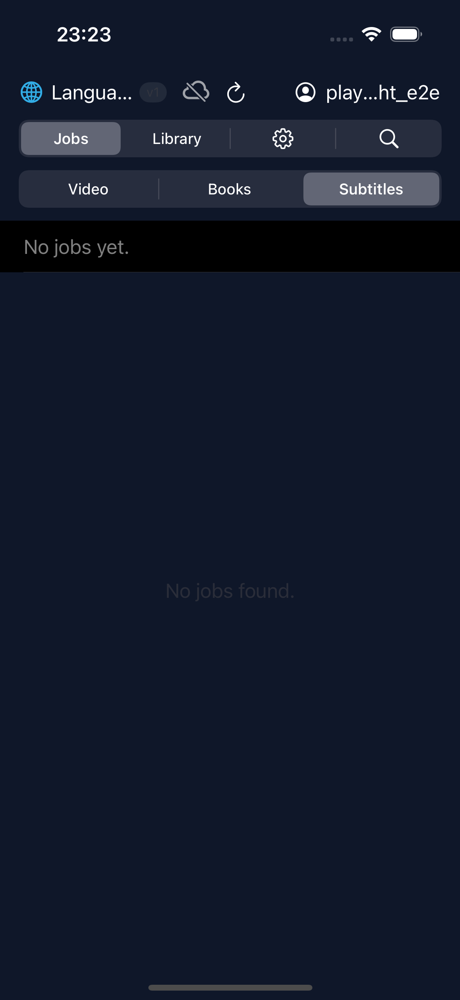
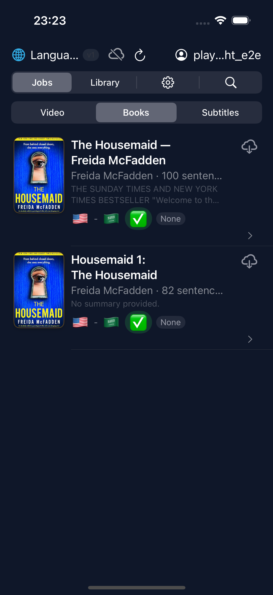
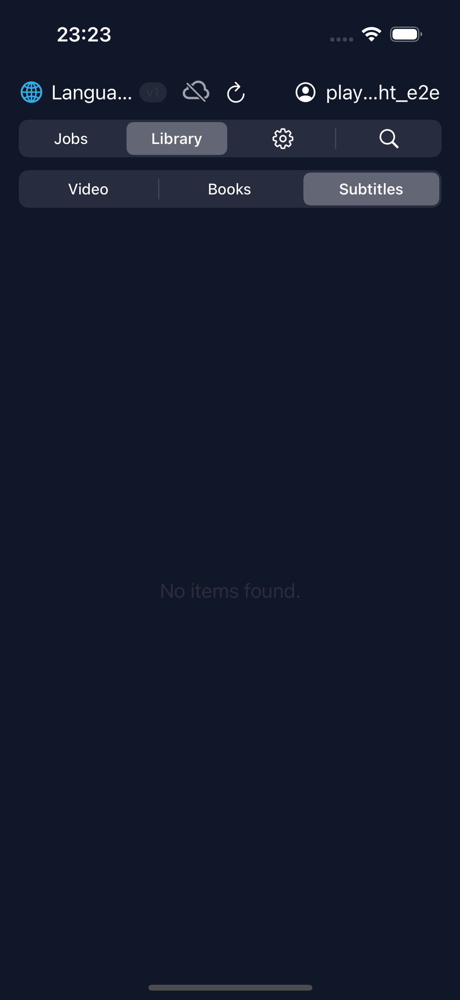
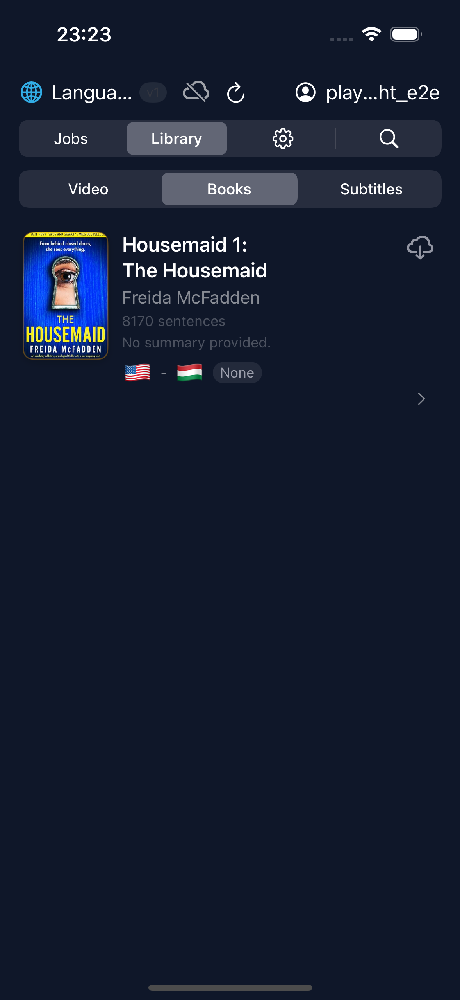
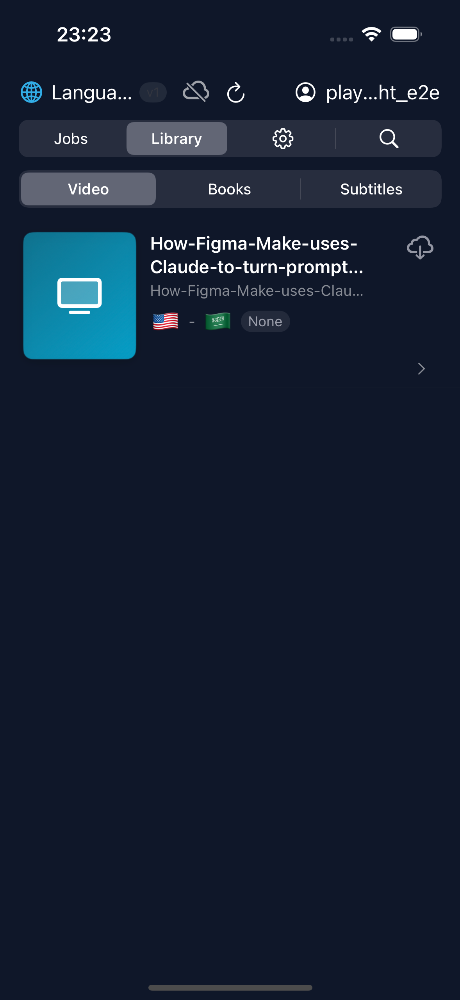
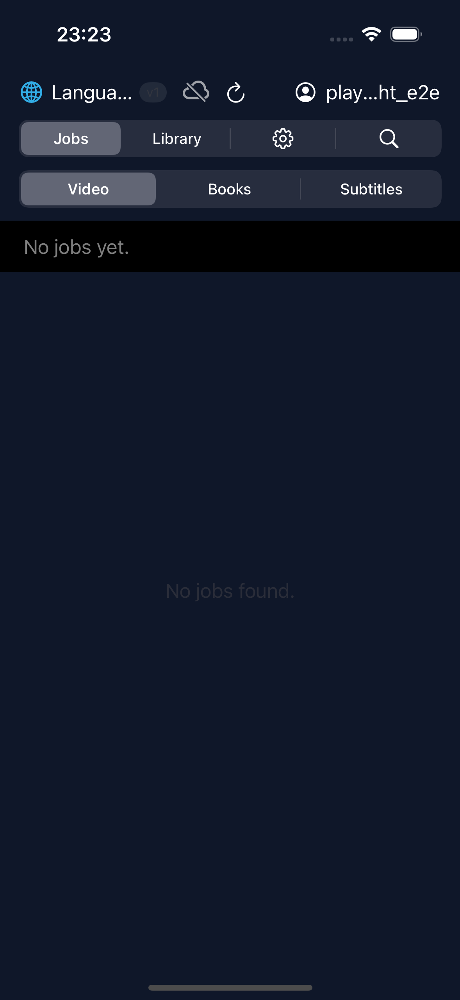
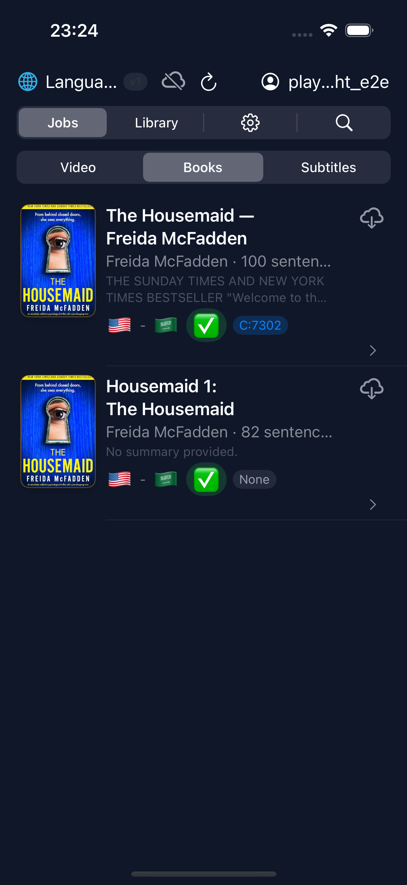
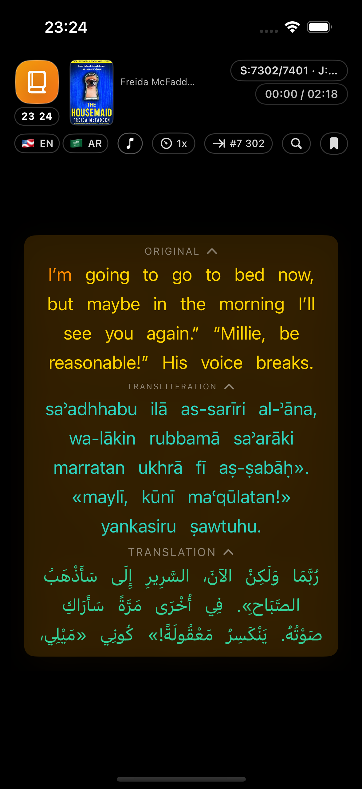

# iOS E2E Test Report

> **2026-02-07 22:24:51 UTC** — iPhone 15 Pro (iOS Simulator 17.5)

| Result | Tests | Passed | Failed | Skipped | Duration |
|--------|-------|--------|--------|---------|----------|
| **PASSED** | 5 | 5 | 0 | 0 | 99.8s |

## Test Results

### `PASSED` testBrowseJobsAllTypes() (LibraryTests) — 18.40s

### `PASSED` testBrowseLibraryAllTypes() (LibraryTests) — 18.49s

### `PASSED` testLoginScreenAppears() (LoginTests) — 10.88s

### `PASSED` testLoginWithCredentials() (LoginTests) — 7.93s

### `PASSED` testStartBookPlaybackAndReturn() (PlaybackTests) — 44.15s

---
*Generated by ebook-tools iOS E2E test suite*
