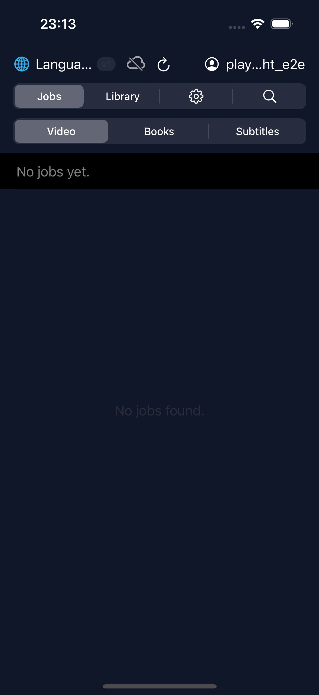

# iOS E2E Test Report

> **2026-02-07 22:14:56 UTC** — iPhone 15 Pro (iOS Simulator 17.5)

| Result | Tests | Passed | Failed | Skipped | Duration |
|--------|-------|--------|--------|---------|----------|
| **PASSED** | 5 | 5 | 0 | 0 | 73.8s |

## Test Results

### `PASSED` testLibraryHasItems() (LibraryTests) — 11.57s

### `PASSED` testLibraryLoads() (LibraryTests) — 9.04s

### `PASSED` testLoginScreenAppears() (LoginTests) — 10.86s

### `PASSED` testLoginWithCredentials() (LoginTests) — 7.93s

### `PASSED` testTapItemOpensPlayer() (PlaybackTests) — 34.39s

---
*Generated by ebook-tools iOS E2E test suite*
