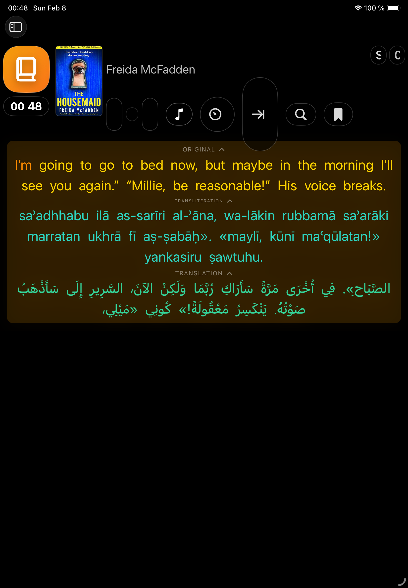
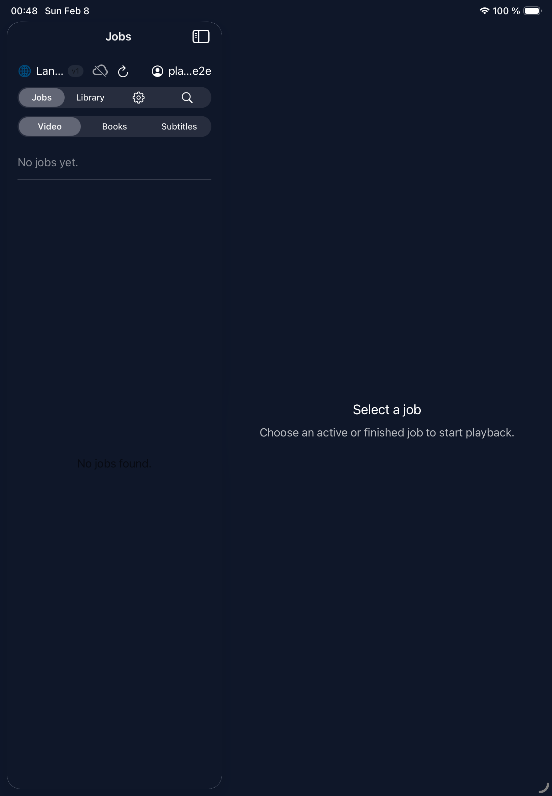
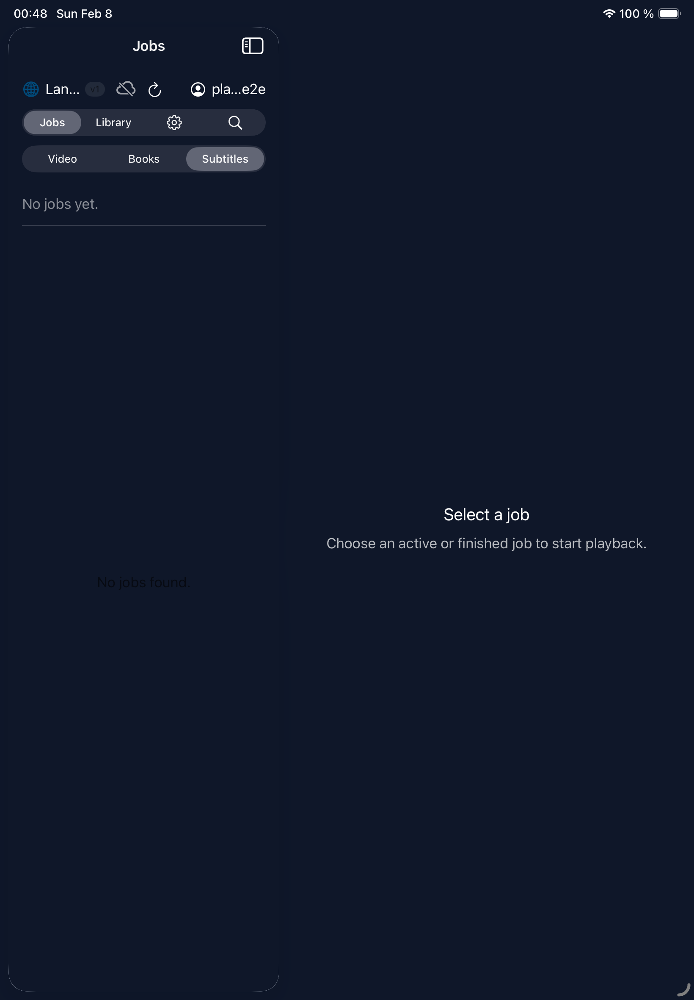
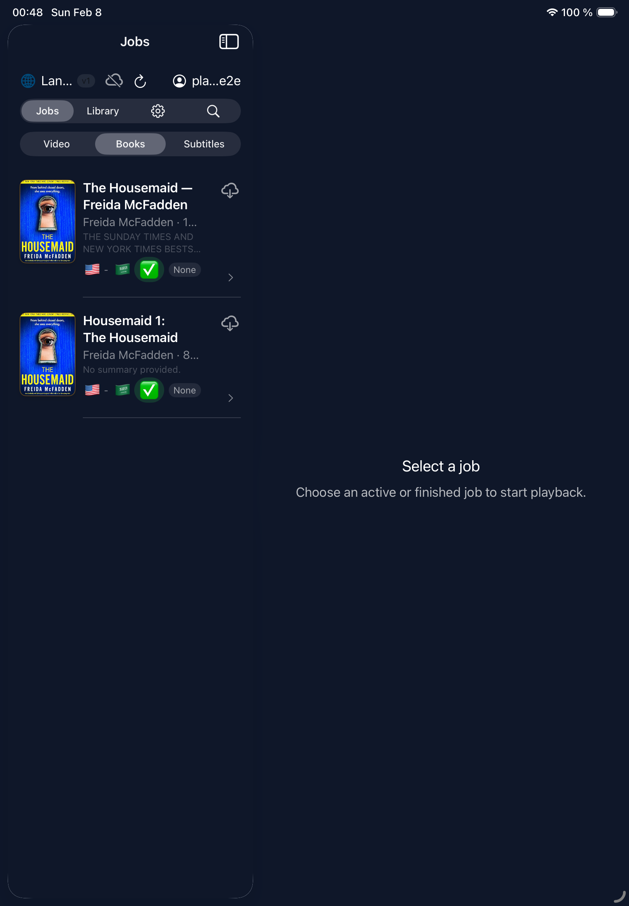
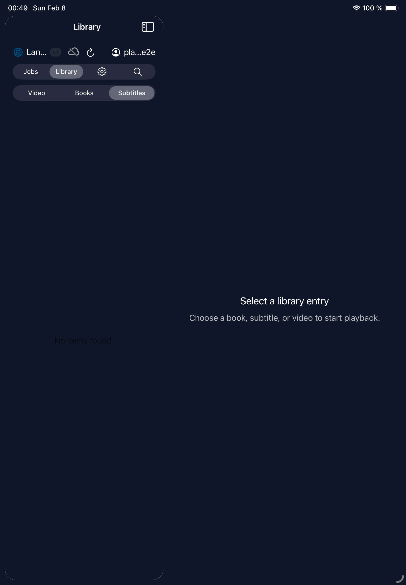
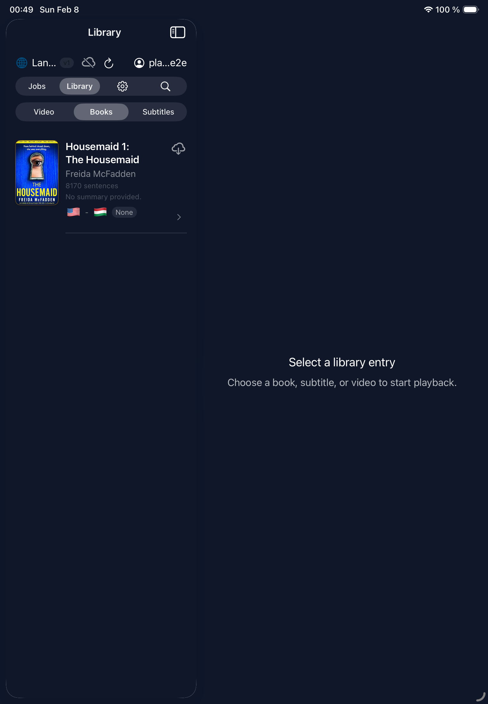
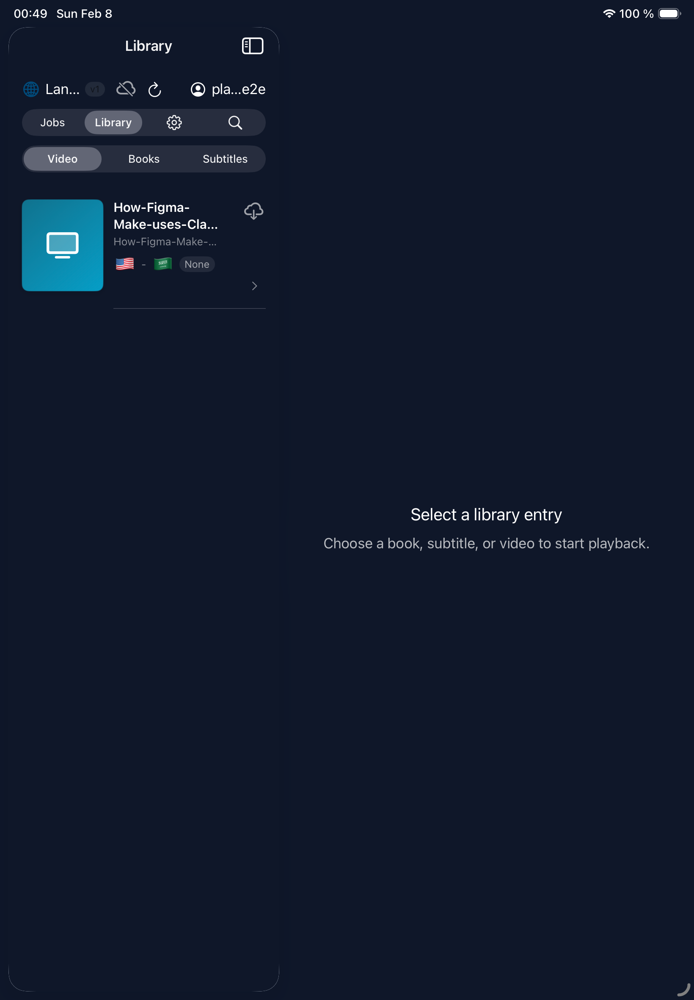
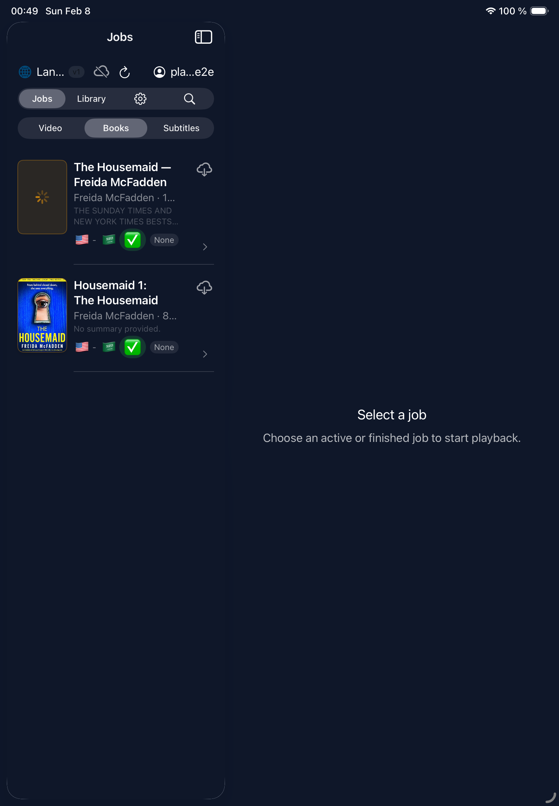

# iPad E2E Test Report

> **2026-02-07 23:49:55 UTC** — iPad Air 11-inch (M3) (iOS Simulator 26.2)

| Result | Tests | Passed | Failed | Skipped | Duration |
|--------|-------|--------|--------|---------|----------|
| **PASSED** | 6 | 6 | 0 | 0 | 108.0s |

## Test Results

### `PASSED` testJourney() (JourneyTests) — 22.70s

### `PASSED` testBrowseJobsAllTypes() (LibraryTests) — 21.09s

### `PASSED` testBrowseLibraryAllTypes() (LibraryTests) — 22.35s

### `PASSED` testLoginScreenAppears() (LoginTests) — 11.48s

### `PASSED` testLoginWithCredentials() (LoginTests) — 8.48s

### `PASSED` testStartBookPlaybackAndReturn() (PlaybackTests) — 21.85s

---
*Generated by ebook-tools iOS E2E test suite*
