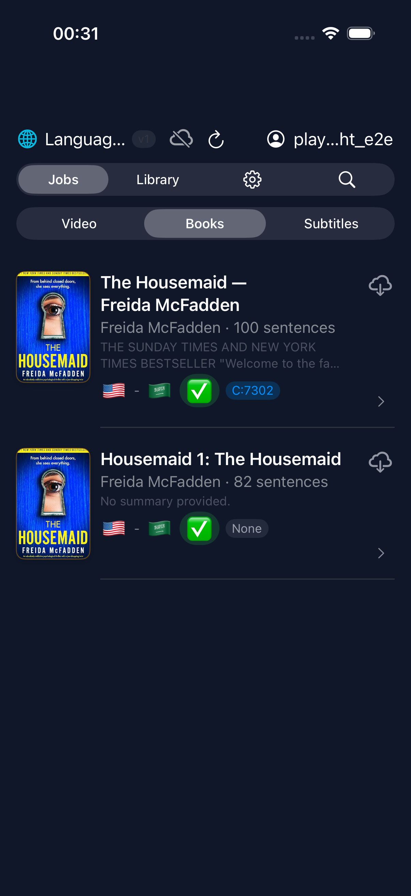
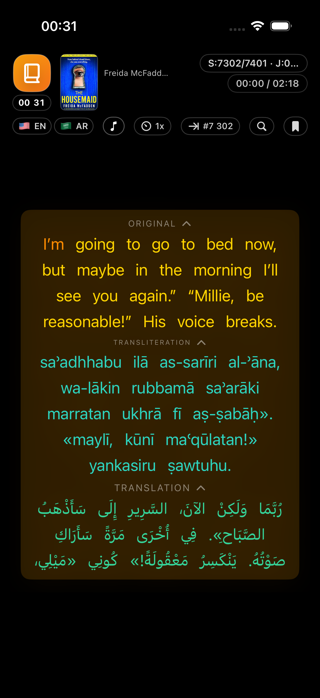
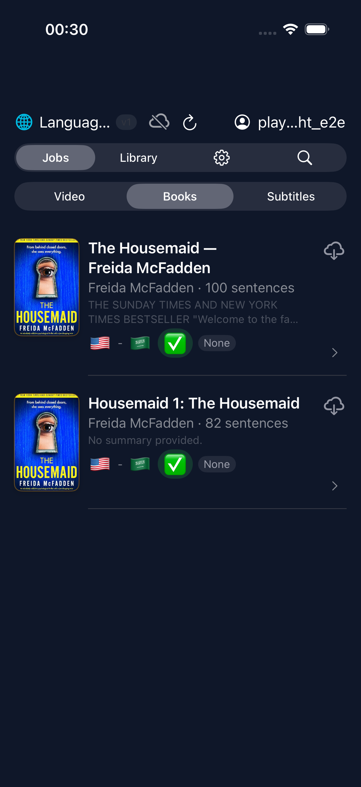
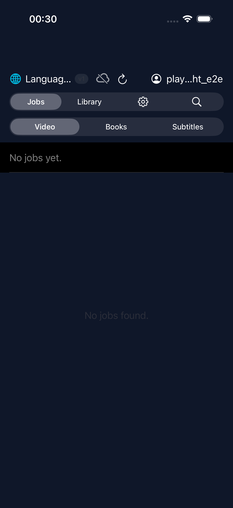
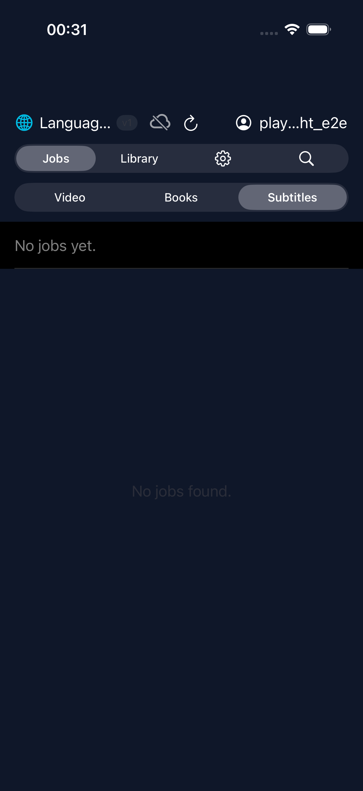
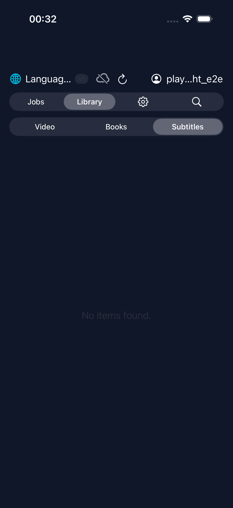
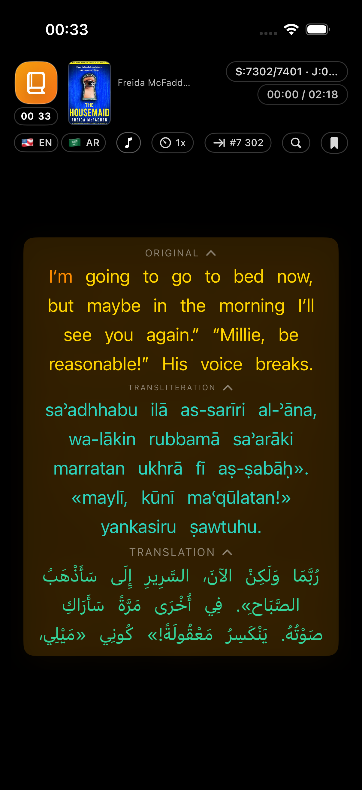

# iPhone E2E Test Report

> **2026-02-07 23:33:11 UTC** — iPhone 17 Pro (iOS Simulator 26.2)

| Result | Tests | Passed | Failed | Skipped | Duration |
|--------|-------|--------|--------|---------|----------|
| **PASSED** | 6 | 6 | 0 | 0 | 157.5s |

## Test Results

### `PASSED` testJourney() (JourneyTests) — 48.57s

### `PASSED` testBrowseJobsAllTypes() (LibraryTests) — 20.92s

### `PASSED` testBrowseLibraryAllTypes() (LibraryTests) — 21.74s

### `PASSED` testLoginScreenAppears() (LoginTests) — 11.43s

### `PASSED` testLoginWithCredentials() (LoginTests) — 8.52s

### `PASSED` testStartBookPlaybackAndReturn() (PlaybackTests) — 46.36s

---
*Generated by ebook-tools iOS E2E test suite*
