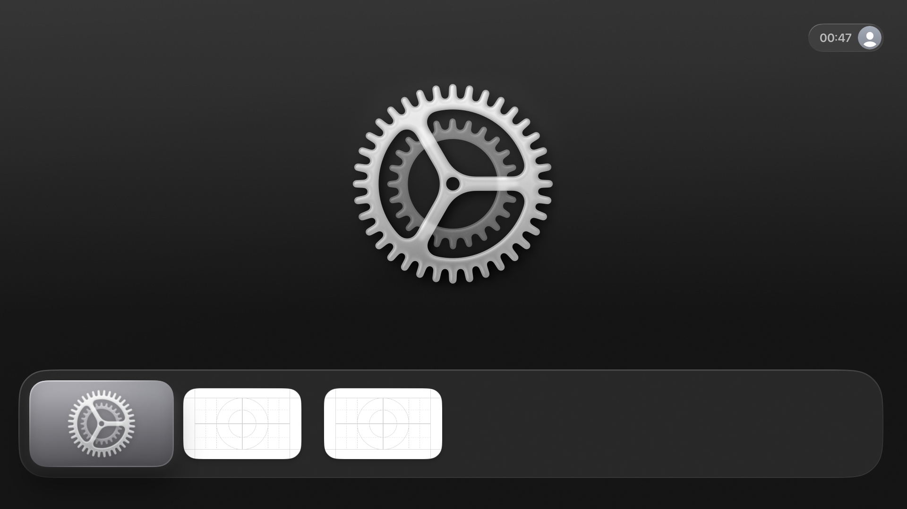
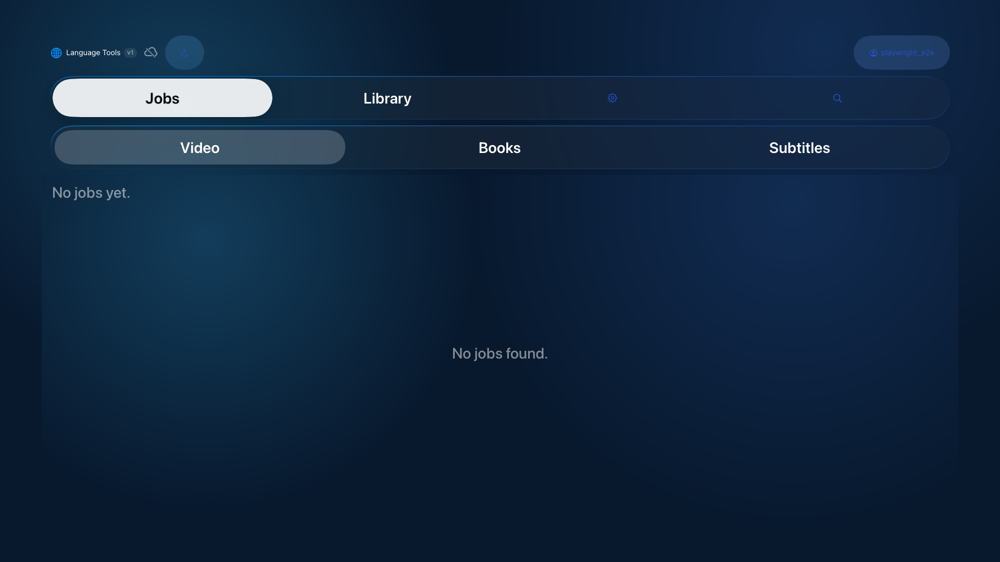

# tvOS E2E Test Report

> **2026-02-07 23:47:32 UTC** — Apple TV (tvOS Simulator 26.2)

| Result | Tests | Passed | Failed | Skipped | Duration |
|--------|-------|--------|--------|---------|----------|
| **PASSED** | 3 | 3 | 0 | 0 | 66.3s |

## Test Results

### `PASSED` testJourney() (JourneyTests) — 45.73s

### `PASSED` testLoginScreenAppears() (LoginTests) — 11.86s

### `PASSED` testLoginWithCredentials() (LoginTests) — 8.72s

---
*Generated by ebook-tools iOS E2E test suite*
